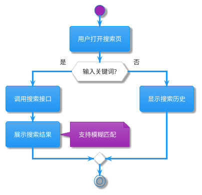
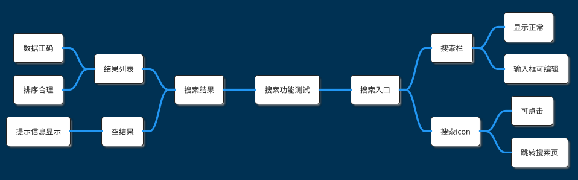
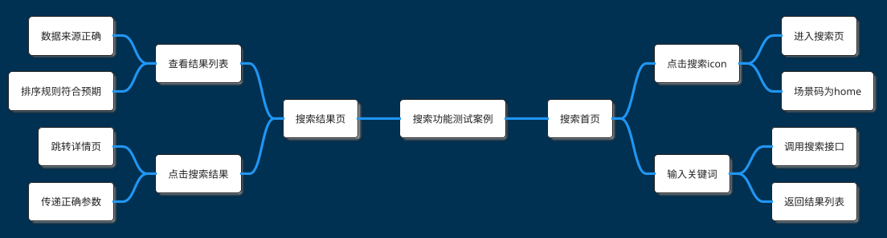

# 手工测试案例生成器

## 技能目标

基于需求文档生成可视化的测试设计，包括PlantUML 流程图和测试用例 MindMap，帮助测试团队快速设计全面的手工测试方案，适用于需求分析、测试评审和团队协作场景。

## 核心功能

### 1. 需求文档解析

**支持的文档格式**：
- Word 文档（.doc, .docx）
- Markdown 文件（.md）
- 纯文本文件（.txt）
- PDF 文档（.pdf）

**解析策略**：
- **自动识别文档结构**：章节标题、段落、列表、表格
- **提取业务信息**：功能描述、业务流程、验收标准、异常场景
- **容错处理**：即使文档不规范，仍尽力提取有用信息

**文档来源**：
- 单个或多个需求文档
- 支持任意目录位置（用户指定路径）
- 允许混合格式（同时处理 Word 和 Markdown）

>💡 **提示**：文档质量越高，生成的测试用例越精准。建议文档包含清晰的功能描述和业务流程。

### 2. PlantUML 流程图生成

根据需求文档生成 PlantUML Activity Diagram，展示完整的业务流程。

**生成内容**：
- **主要流程**：核心业务步骤和操作
- **关键决策点**：条件分支和判断逻辑
- **异常处理**：错误场景和回滚流程
- **注释说明**：复杂步骤的解释（使用 `note` 语法）

**PlantUML 格式**：


**流程图特点**：
- 使用 `!theme materia` 主题（简洁美观）
- 整合所有需求文档的流程（多文档合并）
- 仅包含需求明确提及的内容（不添加推测）
- 复杂步骤添加注释（便于理解）

> 📖 **详细规则**：参见 `references/01-flowchart-generation.md` - PlantUML 流程图生成规则

### 3. 测试功能点 MindMap

基于需求文档生成测试功能点的 PlantUML MindMap，至少三层结构。

**生成内容**：
- **根节点**：项目或模块名称
- **一级节点**：主要功能模块（循环使用 `right side` / `left side`）
- **二级节点**：具体功能点
- **三级节点**：验证点或子功能

**PlantUML 格式**：


**命名规范**（重要）：
- ✅ **去掉"测试"后缀**：使用"搜索栏"而非"搜索栏测试"
- ✅ **简化验证点表达**：使用"显示正常"而非"验证搜索栏显示正常"
- ✅ **功能模块 - 验证点**结构：采用父子节点关系
  - 示例：`搜索栏` → `显示正常`
  - 避免：`验证搜索栏显示正常`

**节点组织**：
- 一级节点前添加 `right side` 或 `left side`（循环交替）
- 避免单独设置"边界值"、"安全"、"性能"一级节点（建议分散到具体功能下）
- 每个叶子节点应该可测试和可验证

> 📖 **详细规则**：参见 `references/02-test-points-mindmap.md` - 测试功能点 MindMap 生成规则

### 4. 详细测试案例 MindMap

基于测试功能点扩展为详细测试案例，至少四层结构。

**生成内容**：
- **根节点**：测试案例集名称
- **一级节点**：测试场景（循环使用 `right side` / `left side`）
- **二级节点**：测试步骤（操作节点）
- **三级节点**：验证点（预期结果节点）
- **四级节点**：详细验证内容（可选）

**PlantUML 格式**：


**命名规范**（关键）：
- ✅ **去掉"测试"后缀**：场景名称直接使用功能名称
- ✅ **动作与结果分离**：
  - 操作节点：`点击搜索icon`、`输入关键词`
  - 验证节点：`进入搜索页`、`场景码为home`
- ✅ **在操作节点下展开多个验证子节点**：
  ```
  ** 搜索首页
  *** 点击搜索icon        ← 操作节点
  **** 进入搜索页          ← 验证节点1
  **** 场景码为home         ← 验证节点2
  ```

**数据传递标记**（可选）：
- 如果测试步骤涉及数据传递，使用 `{{步骤N.字段名}}` 标记
- 示例：`用户ID: {{步骤1.返回的userId}}`
- 便于后续理解测试步骤间的依赖关系

> 📖 **详细规则**：参见 `references/03-test-cases-mindmap.md` - 详细测试案例 MindMap 生成规则

## 工作流程

### 步骤 1：文档接收与解析
```
接收需求文档（支持多种格式）→ 识别文档结构 → 提取业务信息 → 识别功能模块和业务流程
```

### 步骤 2：生成流程图
```
分析业务流程 → 识别主要步骤和决策点 → 生成PlantUML Activity Diagram
```

### 步骤 3：生成测试功能点
```
提取功能模块 → 分解为功能点 → 生成三层MindMap → 应用命名规范
```

### 步骤 4：生成详细测试案例
```
基于测试功能点 → 扩展为测试步骤 → 生成四层 MindMap → 区分操作和验证
```

### 步骤 5：输出 Markdown 文件
```
整合三个PlantUML 代码块 → 添加测试策略说明 → 输出到指定目录
```

## 输出格式

生成的 Markdown 文件包含以下部分：

### 1. 文档信息
```markdown
# XX项目 手工测试案例

## 文档信息
- **生成时间**: 2026-03-17 14:30:00
- **需求文档来源**:
  - ./docs/requirement1.md
  - ./docs/requirement2.docx
- **生成模式**: 弱标准模式（快速生成）
```

### 2. 业务流程图
````markdown
## 业务流程图

```plantuml
@startuml
!theme materia

start
:用户打开搜索页;
...
stop

@enduml
```
````

### 3. 测试功能点
````markdown
## 测试功能点

```plantuml
@startmindmap
!theme blueprint
!theme materia

* 搜索功能测试

right side
** 搜索入口
*** 搜索栏
...

@endmindmap
```
````

### 4. 详细测试案例
````markdown
## 详细测试案例

```plantuml
@startmindmap
!theme blueprint
!theme materia

* 搜索功能测试案例

right side
** 搜索首页
*** 点击搜索icon
...

@endmindmap
```
````

### 5. 测试策略建议
```markdown
## 测试策略建议

### 测试重点
- 核心业务流程：搜索功能、结果展示
- 异常场景：空结果、网络异常

### 测试优先级
- P0（高优先级）：核心搜索流程
- P1（中优先级）：结果排序、筛选
- P2（低优先级）：搜索历史、推荐

### 测试方法
- 功能测试：覆盖所有功能点
- 边界值测试：空输入、超长输入
- 兼容性测试：不同设备和浏览器
```

> 📖 **完整示例**：参见 `examples/sample-output.md` - 完整输出示例

## 使用指南

### 基本用法

```bash
# 从单个文档生成
/manual-case-generator ./docs/requirement.md

# 从多个文档生成（自动合并）
/manual-case-generator ./docs/req1.md ./docs/req2.docx ./docs/req3.txt

# 指定输出目录
/manual-case-generator ./docs/requirement.md --output ./custom-output
```

### 参数说明

| 参数 | 说明 | 示例 |
|---- | ---- | ---- |
| `<文档路径>` | 需求文档路径（必填，支持多个） | `./docs/req.md` |
| `--output <目录>` | 输出目录（可选，默认 `./result/`） | `--output ./output` |
| `--format <格式>` | 输出格式（可选，默认 `markdown`） | `--format markdown` |
| `--no-strategy` | 不生成测试策略建议（可选） | `--no-strategy` |

### 使用场景

#### 场景 1：快速生成测试设计

```bash
# 产品提供需求文档后立即生成测试设计
/manual-case-generator ./docs/new-feature.md
```

**预期输出**：
- `./result/new_feature_手工测试案例.md`
- 包含流程图、测试功能点、详细测试案例

#### 场景 2：多文档整合

```bash
# 多个需求文档整合为一个测试方案
/manual-case-generator ./docs/req1.md ./docs/req2.md ./docs/req3.docx
```

**预期输出**：
- `./result/integrated_手工测试案例.md`
- 自动合并所有文档的流程和功能点

#### 场景 3：测试评审

```bash
# 生成可视化测试用例用于评审
/manual-case-generator ./docs/requirement.docx --output ./review
```

**预期输出**：
- `./review/requirement_手工测试案例.md`
- 团队可以在线查看 PlantUML 渲染结果

## 注意事项

### 文档质量建议

文档质量直接影响生成效果。包含以下内容可获得更佳结果：
- ✅ 清晰的功能描述
- ✅ 明确的业务流程
- ✅ 具体的验收标准
- ✅ 异常场景说明

文档过于简单或不规范时，生成的测试用例可能不够全面。

### PlantUML 渲染

生成的 PlantUML 代码可以使用以下工具渲染：
- **在线渲染**：[PlantUML Online](http://www.plantuml.com/plantuml/uml/)
- **VS Code 插件**：PlantUML
- **本地渲染**：安装 PlantUML CLI

### 后续优化

本技能生成的测试案例适合人工 Review 和调整：
- 📝 人工补充遗漏的测试点
- 📝 调整测试优先级
- 📝 细化测试步骤

如需生成自动化测试代码，可将此输出作为参考，结合 `api-case-generator` 技能。

## 最佳实践建议

### 1. 文档准备

- **单一职责**：每个文档聚焦一个功能模块
- **清晰结构**：使用标题、列表、表格组织内容
- **完整信息**：包含功能、流程、验收标准

### 2. 测试设计

- **优先核心流程**：先设计主要业务流程的测试
- **覆盖异常场景**：不要忽略错误处理和边界条件
- **合理分层**：功能点分解到合适的粒度（不宜过粗或过细）

### 3. 团队协作

- **评审机制**：生成后组织团队评审，补充遗漏点
- **版本管理**：将生成的测试案例纳入版本控制
- **持续更新**：需求变更后及时更新测试设计

## 额外资源

### 参考文件

详细的技术参考和规则：
- **`references/01-flowchart-generation.md`** - PlantUML 流程图生成规则
- **`references/02-test-points-mindmap.md`** - 测试功能点 MindMap 生成规则
- **`references/03-test-cases-mindmap.md`** - 详细测试案例 MindMap 生成规则
- **`references/04-naming-conventions.md`** - 测试案例命名规范详解

### 示例文件

实用的完整示例：
- **`examples/sample-requirement.md`** - 示例需求文档
- **`examples/sample-output.md`** - 完整输出示例
- **`examples/sample-flowchart.puml`** - 流程图示例
- **`examples/sample-test-points.puml`** - 测试功能点示例
- **`examples/sample-test-cases.puml`** - 测试案例示例

---

**状态**: 🚧 开发中（弱标准模式）| **预计完成**: 2026-04-20
