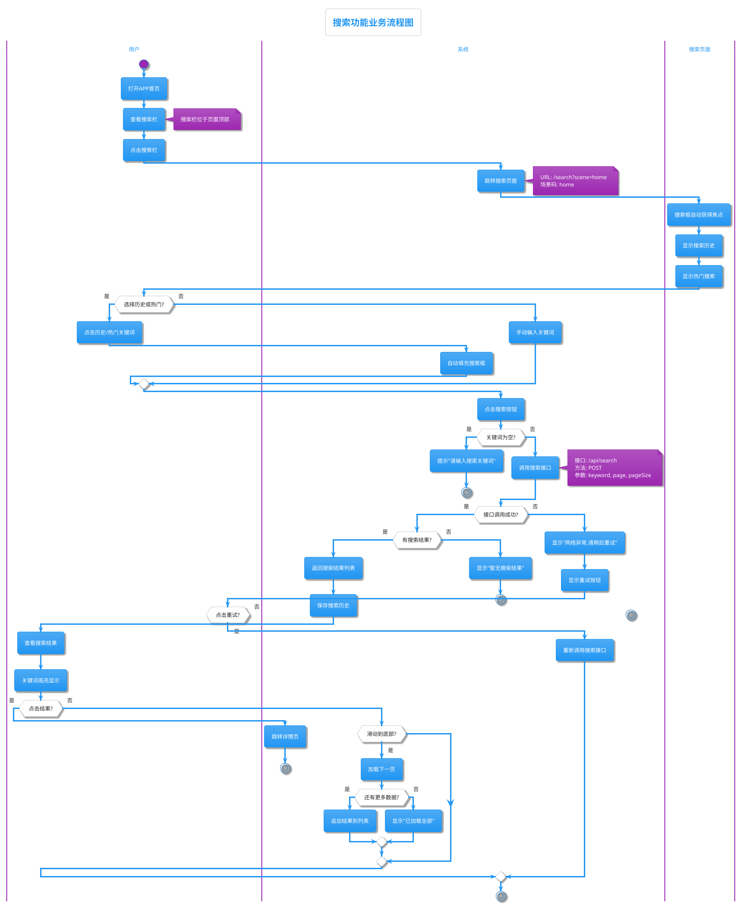
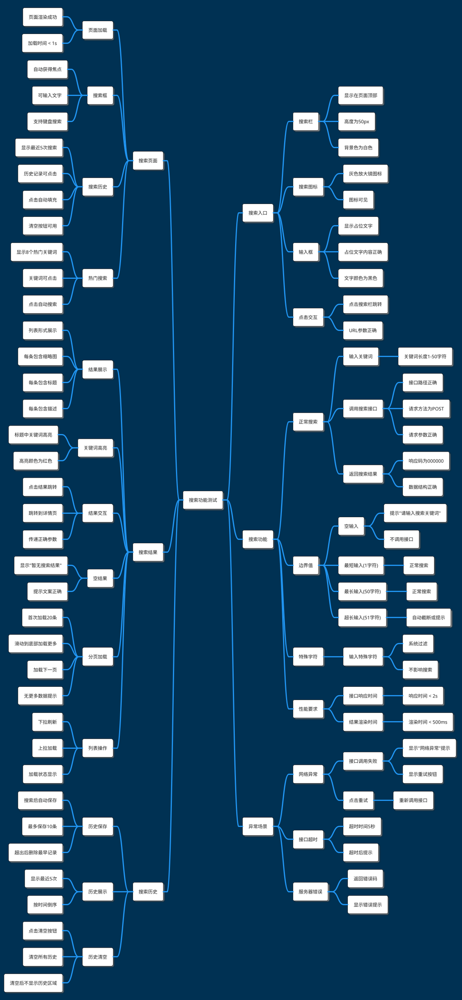
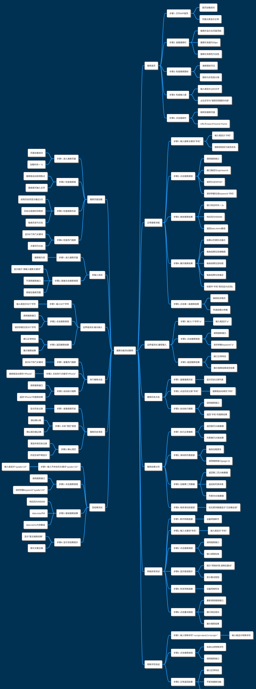

# 搜索功能手工测试案例

## 文档信息

- **生成时间**: 2026-03-17 15:30:00
- **需求文档来源**:
  - ./examples/sample-requirement.md
- **生成模式**: 弱标准模式（快速生成）
- **生成工具**: manual-case-generator v1.0.0

---

## 业务流程图

以下流程图展示了搜索功能的完整业务流程，包括正常流程和异常处理。

**流程图说明**：
- 涵盖了用户从首页进入搜索到查看结果的完整流程
- 包含了空输入、网络异常、空结果等异常场景
- 展示了搜索历史和热门搜索的交互逻辑
- 包含了分页加载的流程

---

## 测试功能点

以下思维导图展示了搜索功能的测试功能点分解，至少三层结构。

**功能点统计**：
- 一级功能模块：6个
- 二级功能点：30+个
- 三级验证点：60+个

**覆盖范围**：
- ✅ 搜索入口：UI展示、交互逻辑
- ✅ 搜索页面：页面加载、搜索框、历史记录、热门搜索
- ✅ 搜索功能：正常搜索、边界值、特殊字符、性能
- ✅ 搜索结果：结果展示、关键词高亮、分页加载
- ✅ 异常场景：网络异常、接口超时、服务器错误
- ✅ 搜索历史：历史保存、展示、清空

---

## 详细测试案例

以下思维导图展示了详细的测试案例，至少四层结构，包含操作步骤和验证点。

**测试案例统计**：
- 测试场景：13个
- 测试步骤：50+个
- 验证点：100+个

**场景分类**：
- ✅ 正常场景：4个（搜索首页、搜索页面加载、正常搜索、分页加载）
- ✅ 异常场景：2个（空输入、网络异常）
- ✅ 边界场景：2个（最短输入、最长输入）
- ✅ 交互场景：3个（搜索历史点击、热门搜索点击、历史清空）
- ✅ 特殊场景：2个（空结果、特殊字符）

---

## 测试策略建议

### 测试重点

1. **核心业务流程**（P0级）：
   - 搜索入口展示和跳转
   - 正常搜索流程（输入→搜索→结果展示）
   - 搜索结果点击跳转

2. **重要功能**（P1级）：
   - 搜索历史保存和使用
   - 热门搜索展示和使用
   - 搜索结果分页加载
   - 关键词高亮显示

3. **辅助功能**（P2级）：
   - 搜索历史清空
   - 下拉刷新
   - 空结果提示
   - 特殊字符过滤

### 测试优先级

- **P0（高优先级）**：核心搜索流程，占比30%
- **P1（中优先级）**：重要功能和交互，占比50%
- **P2（低优先级）**：辅助功能和边界场景，占比20%

### 测试方法

1. **功能测试**：
   - 覆盖所有功能点
   - 按测试案例逐一执行
   - 验证UI、交互、数据正确性

2. **边界值测试**：
   - 空输入、最短输入(1字符)、最长输入(50字符)
   - 超长输入(51字符)
   - 特殊字符输入

3. **异常测试**：
   - 网络异常（断网、超时）
   - 服务器错误（500、404）
   - 接口返回异常数据

4. **性能测试**：
   - 页面加载时间 < 1s
   - 接口响应时间 < 2s
   - 结果渲染时间 < 500ms

5. **兼容性测试**：
   - iOS（不同版本系统）
   - Android（不同版本系统）
   - 不同设备（手机、平板）

### 测试环境

- **开发环境**：Dev环境，用于开发阶段的自测
- **测试环境**：QE环境，用于功能测试和回归测试
- **预发布环境**：UAT环境，用于验收测试
- **生产环境**：Production环境，用于上线前的冒烟测试

### 测试数据

- **正常数据**：常用搜索关键词（手机、电脑、服装等）
- **边界数据**：1字符、50字符、特殊字符
- **异常数据**：超长文本、SQL注入字符、XSS攻击代码

### 风险点

1. **性能风险**：
   - 搜索接口响应慢影响用户体验
   - 大量数据加载导致页面卡顿
   - **建议**：进行性能压测，优化接口响应速度

2. **安全风险**：
   - 特殊字符可能导致XSS攻击
   - SQL注入风险
   - **建议**：加强输入校验和过滤

3. **兼容性风险**：
   - 不同设备和系统版本表现不一致
   - **建议**：覆盖主流设备和系统版本

4. **数据风险**：
   - 搜索历史泄露用户隐私
   - **建议**：本地存储加密，定期清理

---

## 附录

### 相关文档

- 产品需求文档：PRD_搜索功能_V1.0.docx
- UI设计稿：Search_UI_Design_V1.0.fig
- 接口文档：API_Search_V1.0.md

### 测试工具

- 抓包工具：Charles、Fiddler
- 自动化工具：Appium、XCTest
- 性能工具：JMeter、LoadRunner
- PlantUML渲染：[PlantUML Online](http://www.plantuml.com/plantuml/uml/)

### 版本历史

- **V1.0.0**（2026-03-17）：初始版本，完成搜索功能测试案例设计

---

**生成说明**：本文档由 manual-case-generator 自动生成，基于需求文档 `sample-requirement.md`。如需修改，请更新需求文档后重新生成。
