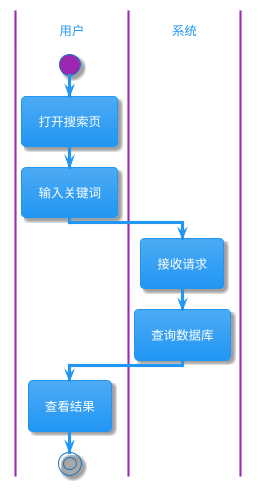
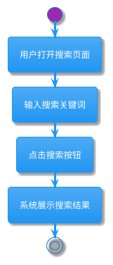
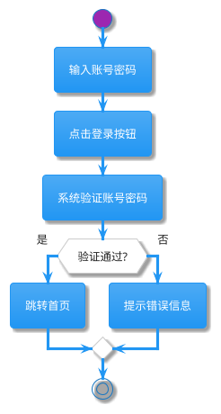
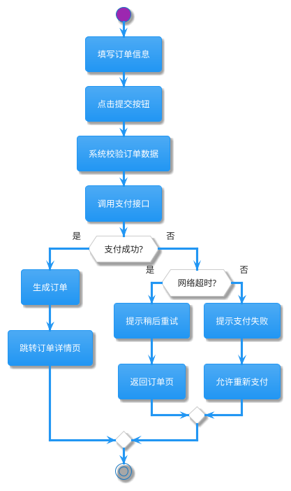
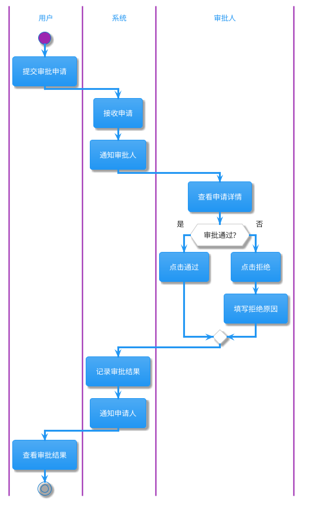
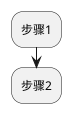

# PlantUML 流程图生成规则

本文档详细说明如何从需求文档生成 PlantUML Activity Diagram（活动图）。

## 🎯 生成目标

将需求文档中的业务流程转化为可视化的流程图，展示：
- 完整的业务操作步骤
- 关键的决策分支
- 异常处理流程
- 重要的状态流转

## 📋 PlantUML Activity Diagram 基础语法

### 基本结构


### 决策分支

```plantuml
if (条件判断?) then (是)
  :执行操作A;
else (否)
  :执行操作B;
endif
```

### 并行处理

```plantuml
fork
  :并行任务1;
fork again
  :并行任务2;
end fork
```

### 循环结构

```plantuml
repeat
  :重复执行的操作;
repeat while (继续?) is (是)
->否;
```

### 注释说明

```plantuml
:复杂步骤;
note right: 这里是注释说明
```

### 分区（泳道）

```plantuml
|用户|
:打开页面;
|系统|
:加载数据;
|用户|
:查看结果;
```

## 🔍 从需求文档提取流程信息

### 识别流程起点和终点

**关键词识别**：
- **起点**：用户打开、进入、启动、开始、发起
- **终点**：完成、关闭、退出、结束、返回

**示例**：
```markdown
需求文档：
"用户打开搜索页面，输入关键词后点击搜索按钮，系统展示搜索结果。"

识别：
- 起点：用户打开搜索页面
- 终点：展示搜索结果
```

### 识别操作步骤

**关键词识别**：
- 动词：打开、输入、点击、提交、选择、确认
- 对象：页面、按钮、输入框、列表、弹窗

**示例**：
```markdown
需求文档：
"用户在搜索框输入关键词，点击搜索按钮。"

提取步骤：
1. 在搜索框输入关键词
2. 点击搜索按钮
```

### 识别决策分支

**关键词识别**：
- 条件：如果、假如、当、是否
- 分支：则、否则、否、那么

**示例**：
```markdown
需求文档：
"如果搜索结果为空，则显示'暂无结果'提示；否则显示结果列表。"

提取决策：
- 条件：搜索结果是否为空
- 分支1（是）：显示'暂无结果'提示
- 分支2（否）：显示结果列表
```

### 识别异常场景

**关键词识别**：
- 异常：失败、错误、超时、异常、无权限
- 处理：提示、回滚、重试、返回

**示例**：
```markdown
需求文档：
"如果网络请求失败，提示用户网络异常，并允许重试。"

提取异常处理：
- 异常：网络请求失败
- 处理：提示用户 + 允许重试
```

## 📐 流程图生成规则

### 规则 1：使用固定主题

**强制使用**：`!theme materia`

**原因**：
- 简洁美观，适合文档展示
- 颜色对比度好，便于打印
- 与项目其他 PlantUML 图保持一致

### 规则 2：合理使用分区（泳道）

**使用场景**：
- 涉及多个角色交互（用户、系统、后台、第三方）
- 需要明确职责划分

**示例**：


**不使用场景**：
- 单一角色的简单流程
- 流程步骤不涉及角色切换

### 规则 3：复杂步骤添加注释

**使用 `note right` 或 `note left`**：

```plantuml
:调用搜索接口;
note right
  接口路径: /api/search
  请求方式: POST
  超时时间: 5秒
end note
```

**注释内容**：
- 技术细节（接口路径、参数格式）
- 业务规则（计算逻辑、特殊条件）
- 重要提示（性能要求、安全注意事项）

### 规则 4：决策分支清晰明确

**使用标准的 if-else 结构**：

```plantuml
if (用户已登录?) then (是)
  :展示个性化内容;
else (否)
  :跳转登录页;
endif
```

**分支标签**：
- 使用清晰的标签（是/否、成功/失败、有/无）
- 避免模糊表达（可能、大概）

### 规则 5：异常处理独立展示

**使用单独的分支或子流程**：

```plantuml
:调用API接口;
if (请求成功?) then (是)
  :处理响应数据;
else (否)
  :显示错误提示;
  :记录错误日志;
  if (允许重试?) then (是)
    :返回重试;
  else (否)
    :返回上一页;
  endif
endif
```

### 规则 6：避免过度复杂

**复杂度控制**：
- 主流程步骤：≤ 15 个
- 决策分支深度：≤ 3 层
- 并行任务数量：≤ 4 个

**简化策略**：
- 复杂子流程提取为独立流程图
- 使用注释替代详细步骤
- 合并相似操作

## 📊 生成示例

### 示例 1：简单流程

**需求文档**：
```
用户搜索功能：
1. 用户打开搜索页面
2. 输入搜索关键词
3. 点击搜索按钮
4. 系统展示搜索结果
```

**生成流程图**：


### 示例 2：包含决策分支

**需求文档**：
```
用户登录功能：
1. 用户输入账号密码
2. 点击登录按钮
3. 系统验证账号密码
4. 如果验证通过，跳转首页；否则提示错误
```

**生成流程图**：


### 示例 3：包含异常处理

**需求文档**：
```
订单提交功能：
1. 用户填写订单信息
2. 点击提交按钮
3. 系统校验订单数据
4. 调用支付接口
5. 如果支付成功，生成订单；如果支付失败，允许重新支付
6. 如果网络超时，提示用户稍后重试
```

**生成流程图**：


### 示例 4：多角色交互

**需求文档**：
```
审批流程：
1. 用户提交审批申请
2. 系统通知审批人
3. 审批人查看申请详情
4. 审批人进行审批（通过/拒绝）
5. 系统通知申请人审批结果
```

**生成流程图**：


## ⚠️ 常见错误和避免方法

### 错误 1：缺少 start/stop

❌ **错误示例**：


✅ **正确示例**：


### 错误 2：if 语句不完整

❌ **错误示例**：
```plantuml
if (条件?) then (是)
  :操作A;
```

✅ **正确示例**：
```plantuml
if (条件?) then (是)
  :操作A;
else (否)
  :操作B;
endif
```

### 错误 3：过度使用分区

❌ **错误示例**（简单流程不需要分区）：
```plantuml
|用户|
:打开页面;
|用户|
:点击按钮;
|用户|
:查看结果;
```

✅ **正确示例**：
```plantuml
start
:打开页面;
:点击按钮;
:查看结果;
stop
```

### 错误 4：决策标签不清晰

❌ **错误示例**：
```plantuml
if (数据?) then (对)
  :操作A;
else (错)
  :操作B;
endif
```

✅ **正确示例**：
```plantuml
if (数据有效?) then (是)
  :处理数据;
else (否)
  :提示数据无效;
endif
```

## 🎯 质量检查清单

生成流程图后，检查以下项：

- [ ] 包含 `@startuml` 和 `@enduml`
- [ ] 包含 `!theme materia`
- [ ] 有明确的 `start` 和 `stop`
- [ ] 所有 `if` 语句有对应的 `endif`
- [ ] 决策分支有清晰的标签（是/否）
- [ ] 复杂步骤添加了注释说明
- [ ] 流程逻辑清晰，无死循环
- [ ] 步骤描述简洁明了（≤10个字）
- [ ] 覆盖了主要业务流程
- [ ] 包含了关键的异常处理

## 📚 参考资源

- [PlantUML Activity Diagram 官方文档](https://plantuml.com/activity-diagram-beta)
- [PlantUML 在线编辑器](http://www.plantuml.com/plantuml/uml/)
- [PlantUML 主题库](https://github.com/plantuml/plantuml/tree/master/themes)

---

**提示**：生成的流程图应该让非技术人员也能理解业务流程，避免过多技术细节。
