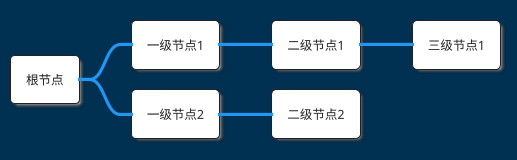
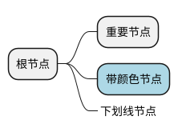
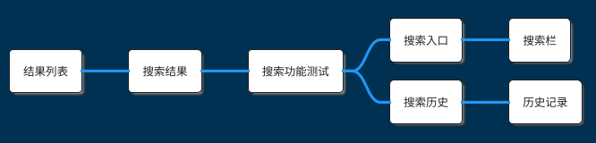
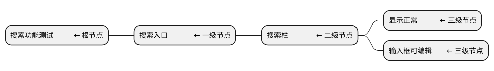
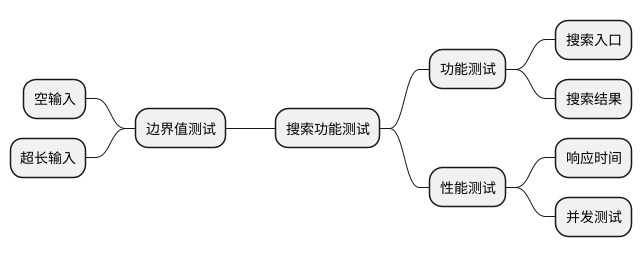
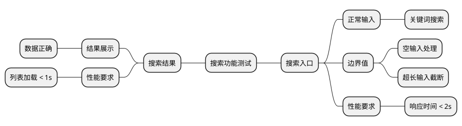
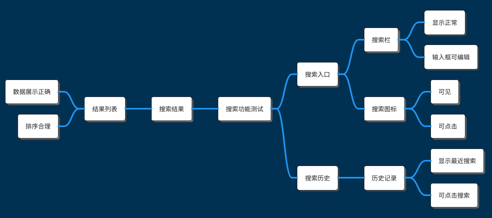
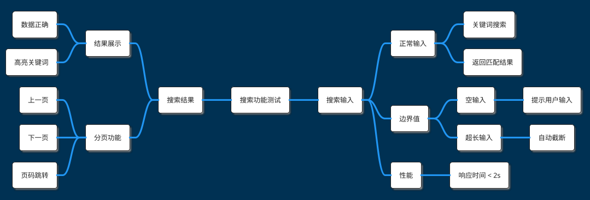
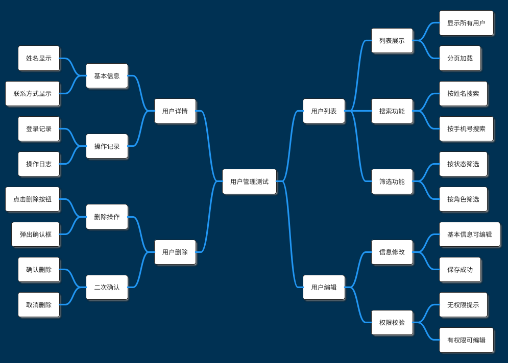

# 测试功能点 MindMap 生成规则

本文档详细说明如何从需求文档生成测试功能点的 PlantUML MindMap（思维导图）。

## 🎯 生成目标

将需求文档中的功能需求转化为可测试的功能点树状结构，至少三层：
- **根节点**：项目或模块名称
- **一级节点**：主要功能模块
- **二级节点**：具体功能点
- **三级节点**：验证点或子功能

## 📋 PlantUML MindMap 基础语法

### 基本结构



### 左右分布


### 节点样式



## 🔍 从需求文档提取功能点

### 识别功能模块

**关键词识别**：
- 模块名称：用户管理、订单系统、支付模块
- 功能分类：查询、新增、修改、删除、导出
- 页面名称：首页、详情页、列表页

**示例**：
```markdown
需求文档：
"搜索功能包含搜索入口、搜索结果展示、搜索历史记录。"

提取功能模块：
- 一级：搜索功能
  - 二级：搜索入口
  - 二级：搜索结果展示
  - 二级：搜索历史记录
```

### 识别验证点

**关键词识别**：
- 显示/展示：页面元素是否正确显示
- 功能/操作：功能是否正常工作
- 数据/内容：数据是否正确
- 交互/跳转：交互逻辑是否正确

**示例**：
```markdown
需求文档：
"搜索栏应显示在页面顶部，包含搜索图标和输入框，输入框支持输入文字。"

提取验证点：
- 功能点：搜索栏
  - 验证点1：显示在页面顶部
  - 验证点2：包含搜索图标
  - 验证点3：包含输入框
  - 验证点4：输入框可编辑
```

### 识别功能分类

**常见功能分类**：
- **展示类**：页面展示、数据展示、UI元素
- **交互类**：点击、输入、滑动、拖拽
- **数据类**：数据查询、数据新增、数据修改、数据删除
- **流程类**：业务流程、状态流转
- **规则类**：业务规则、权限控制、数据校验

## 📐 MindMap 生成规则

### 规则 1：使用双主题

**强制使用**：
```plantuml
!theme blueprint
!theme materia
```

**原因**：
- `blueprint` 提供良好的节点样式
- `materia` 提供清晰的颜色对比
- 两者结合效果最佳

### 规则 2：左右交替分布

**一级节点必须循环使用 `right side` 和 `left side`**：



**原因**：
- 左右平衡，避免单侧过于拥挤
- 提高可读性
- 视觉效果更好

### 规则 3：至少三层结构

**层级定义**：
- **根节点（第0层）**：项目或模块名称
- **一级节点（第1层）**：主要功能模块
- **二级节点（第2层）**：具体功能点
- **三级节点（第3层）**：验证点或子功能

**示例**：


### 规则 4：应用命名规范

#### ✅ 去掉"测试"后缀

❌ **错误**：
```plantuml
** 搜索栏测试
*** 显示测试
```

✅ **正确**：
```plantuml
** 搜索栏
*** 显示正常
```

#### ✅ 简化验证点表达

❌ **错误**：
```plantuml
*** 验证搜索栏显示正常
*** 验证输入框可以输入
```

✅ **正确**：
```plantuml
** 搜索栏
*** 显示正常
*** 输入框可编辑
```

#### ✅ 使用"功能模块 - 验证点"结构

❌ **错误**（单一节点包含所有信息）：
```plantuml
** 验证搜索栏显示在页面顶部且包含搜索图标
```

✅ **正确**（父子节点关系）：
```plantuml
** 搜索栏
*** 显示在页面顶部
*** 包含搜索图标
*** 输入框可编辑
```

### 规则 5：避免单独的边界值/安全/性能节点

❌ **不推荐**（作为单独的一级节点）：


✅ **推荐**（分散到具体功能点下）：


### 规则 6：节点粒度适中

**节点数量建议**：
- 一级节点：3-8 个
- 二级节点：每个一级节点下 2-6 个
- 三级节点：每个二级节点下 2-5 个

**过粗示例**（不推荐）：
```plantuml
** 搜索功能
*** 所有搜索相关功能都正常
```

**过细示例**（不推荐）：
```plantuml
** 搜索栏
*** 搜索栏高度
**** 搜索栏高度为50px
**** 搜索栏高度自适应
*** 搜索栏宽度
**** 搜索栏宽度为100%
```

**适中示例**（推荐）：
```plantuml
** 搜索栏
*** 显示正常
*** 输入框可编辑
*** 搜索图标可点击
```

## 📊 生成示例

### 示例 1：简单功能点

**需求文档**：
```
搜索功能：
- 搜索入口包含搜索栏和搜索图标
- 搜索结果以列表形式展示
- 支持查看搜索历史
```

**生成 MindMap**：


### 示例 2：包含边界值和性能

**需求文档**：
```
搜索功能要求：
- 支持输入关键词搜索
- 空输入时提示用户
- 搜索响应时间不超过2秒
- 结果列表支持分页
```

**生成 MindMap**：


### 示例 3：复杂功能模块

**需求文档**：
```
用户管理功能：
- 用户列表：展示所有用户，支持搜索和筛选
- 用户详情：查看用户基本信息和操作记录
- 用户编辑：修改用户信息，需要权限校验
- 用户删除：删除用户，需要二次确认
```

**生成 MindMap**：


## ⚠️ 常见错误和避免方法

### 错误 1：缺少主题声明

❌ **错误示例**：
```plantuml
@startmindmap
* 测试功能点
** 功能1
@endmindmap
```

✅ **正确示例**：
```plantuml
@startmindmap
!theme blueprint
!theme materia

* 测试功能点
** 功能1

@endmindmap
```

### 错误 2：一级节点不使用 left/right side

❌ **错误示例**（所有节点默认在右侧）：
```plantuml
@startmindmap
* 根节点
** 节点1
** 节点2
** 节点3
@endmindmap
```

✅ **正确示例**：
```plantuml
@startmindmap
* 根节点

right side
** 节点1

left side
** 节点2

right side
** 节点3

@endmindmap
```

### 错误 3：使用"测试"后缀

❌ **错误示例**：
```plantuml
** 搜索栏测试
*** 显示测试
*** 功能测试
```

✅ **正确示例**：
```plantuml
** 搜索栏
*** 显示正常
*** 功能正常
```

### 错误 4：验证点描述冗长

❌ **错误示例**：
```plantuml
*** 验证搜索栏是否显示在页面顶部并且搜索图标可以点击
```

✅ **正确示例**：
```plantuml
** 搜索栏
*** 显示在页面顶部
*** 搜索图标可点击
```

### 错误 5：层级过深

❌ **错误示例**（6层）：
```plantuml
* 根节点
** 一级
*** 二级
**** 三级
***** 四级
****** 五级
```

✅ **正确示例**（3-4层）：
```plantuml
* 根节点
** 一级
*** 二级
**** 三级
```

## 🎯 质量检查清单

生成 MindMap 后，检查以下项：

- [ ] 包含 `@startmindmap` 和 `@endmindmap`
- [ ] 包含 `!theme blueprint` 和 `!theme materia`
- [ ] 至少三层结构（根节点 + 一级 + 二级 + 三级）
- [ ] 一级节点使用了 `right side` / `left side`（循环交替）
- [ ] 节点名称不包含"测试"后缀
- [ ] 验证点描述简洁明了（≤10个字）
- [ ] 没有单独的"边界值"、"性能"、"安全"一级节点
- [ ] 功能点覆盖了主要需求
- [ ] 层级深度适中（≤4层）
- [ ] 每个一级节点下有2-6个二级节点

## 📚 参考资源

- [PlantUML MindMap 官方文档](https://plantuml.com/mindmap-diagram)
- [PlantUML 主题库](https://github.com/plantuml/plantuml/tree/master/themes)

---

**提示**：测试功能点应该覆盖所有可测试的功能，但不需要详细到测试步骤级别（那是测试案例的职责）。
