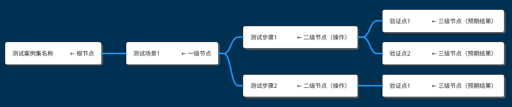
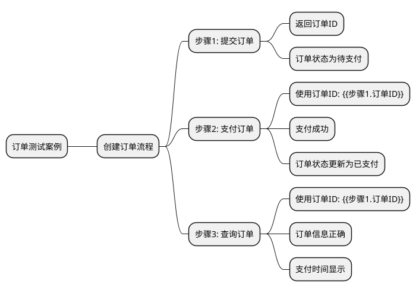
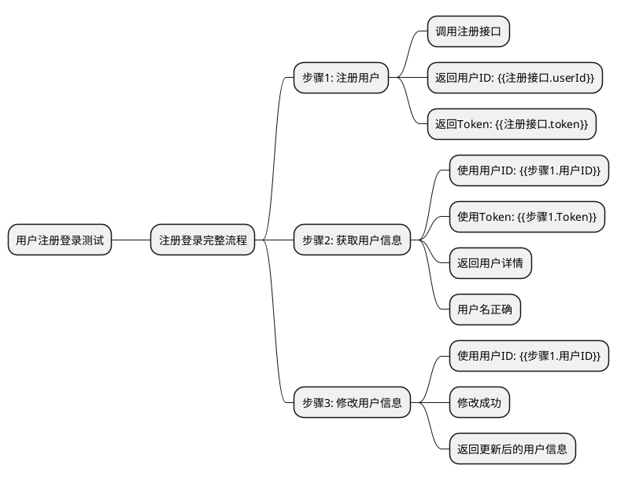
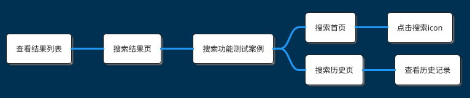
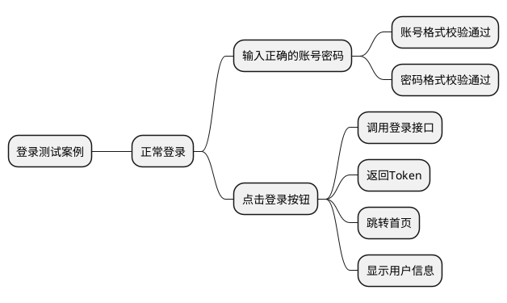
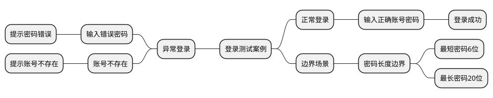
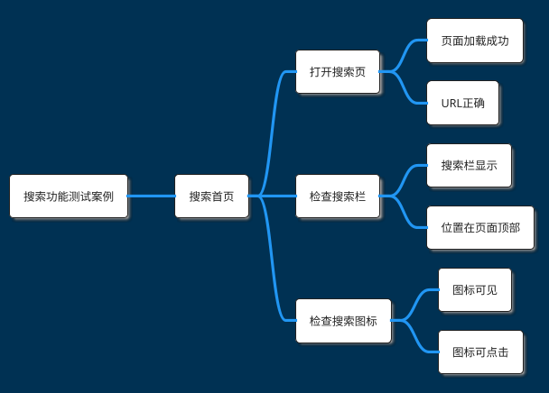
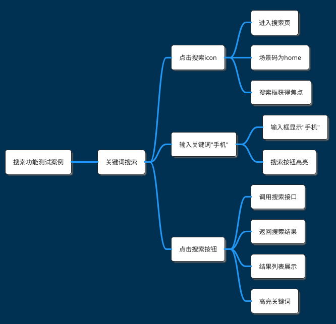
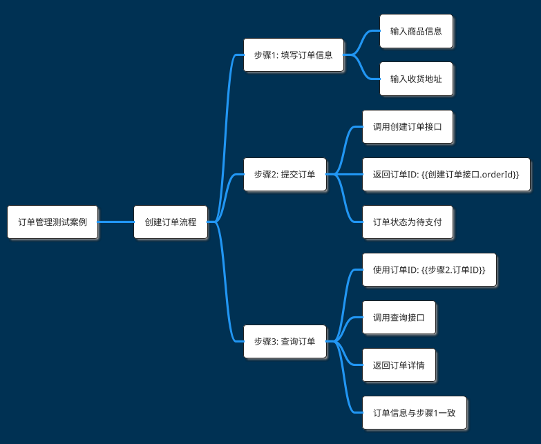

# 详细测试案例 MindMap 生成规则

本文档详细说明如何从测试功能点生成详细测试案例的 PlantUML MindMap，至少四层结构。

## 🎯 生成目标

将测试功能点扩展为可执行的详细测试案例，至少四层：
- **根节点**：测试案例集名称
- **一级节点**：测试场景
- **二级节点**：测试步骤（操作节点）
- **三级节点**：验证点（预期结果节点）
- **四级节点**：详细验证内容（可选）

## 📋 测试案例层级定义

### 层级结构

```
根节点：XX功能测试案例
├── 一级节点：测试场景（如：用户登录场景）
│   ├── 二级节点：测试步骤（如：输入账号密码）
│   │   ├── 三级节点：验证点1（如：账号格式正确）
│   │   ├── 三级节点：验证点2（如：密码格式正确）
│   ├── 二级节点：测试步骤（如：点击登录按钮）
│   │   ├── 三级节点：验证点1（如：跳转首页）
│   │   ├── 三级节点：验证点2（如：显示用户信息）
```

### 节点类型

**操作节点（二级）**：
- 用户操作：点击、输入、滑动、选择
- 系统操作：调用接口、查询数据库、发送通知

**验证节点（三级）**：
- 界面验证：页面跳转、元素显示、样式正确
- 数据验证：数据正确、状态更新、记录保存
- 逻辑验证：业务规则正确、计算结果准确

## 📐 MindMap 生成规则

### 规则 1：至少四层结构

**强制要求**：


### 规则 2：应用命名规范

#### ✅ 去掉"测试"后缀

❌ **错误**：
```plantuml
** 搜索首页测试
*** 点击搜索icon测试
```

✅ **正确**：
```plantuml
** 搜索首页
*** 点击搜索icon
```

#### ✅ 动作与结果分离

**操作节点**：描述具体操作
- 点击搜索icon
- 输入关键词
- 选择筛选条件

**验证节点**：描述预期结果
- 进入搜索页
- 场景码为home
- 显示搜索结果

❌ **错误**（操作和验证混在一起）：
```plantuml
*** 点击搜索icon并进入搜索页
```

✅ **正确**（分离为父子节点）：
```plantuml
*** 点击搜索icon         ← 操作
**** 进入搜索页          ← 验证
**** 场景码为home        ← 验证
```

#### ✅ 验证点简化表达

❌ **错误**：
```plantuml
**** 验证搜索栏显示正常
**** 验证输入框可以输入文字
```

✅ **正确**：
```plantuml
** 搜索栏
*** 显示正常
*** 输入框可编辑
```

### 规则 3：数据传递标记（可选）

**使用场景**：
- 前一步骤的输出作为后一步骤的输入
- 需要明确数据依赖关系
- 便于理解测试步骤间的关联

**标记格式**：`{{步骤N.字段名}}`

**示例**：


**高级示例（跨接口数据传递）**：


### 规则 4：左右交替分布

**一级节点循环使用 `right side` 和 `left side`**：



### 规则 5：操作节点下展开多个验证点

**推荐结构**：
```plantuml
*** 操作节点              ← 二级：用户操作
**** 验证点1              ← 三级：预期结果1
**** 验证点2              ← 三级：预期结果2
**** 验证点3              ← 三级：预期结果3
```

**示例**：


### 规则 6：场景分类

**场景类型**：
- **正常场景**：主流程，Happy Path
- **异常场景**：错误输入、权限不足、网络异常
- **边界场景**：边界值、极限值
- **特殊场景**：特定条件下的流程

**示例**：


## 📊 生成示例

### 示例 1：简单测试场景

**测试功能点**：
```plantuml
* 搜索功能测试
** 搜索入口
*** 搜索栏
**** 显示正常
```

**扩展为测试案例**：


### 示例 2：包含操作和验证

**测试功能点**：
```plantuml
* 搜索功能测试
** 搜索输入
*** 关键词搜索
```

**扩展为测试案例**：


### 示例 3：包含数据传递

**测试功能点**：
```plantuml
* 订单管理测试
** 创建订单
** 查询订单
```

**扩展为测试案例**：


### 示例 4：正常和异常场景

**测试功能点**：
```plantuml
* 登录功能测试
** 用户登录
*** 输入校验
*** 登录逻辑
```

**扩展为测试案例**：
```plantuml
@startmindmap
!theme blueprint
!theme materia

* 登录功能测试案例

right side
** 正常登录
*** 输入账号"user001"
**** 账号格式正确
*** 输入密码"Pass123"
**** 密码格式正确
*** 点击登录按钮
**** 调用登录接口
**** 返回Token
**** 跳转首页
**** 显示用户名

left side
** 异常登录-密码错误
*** 输入账号"user001"
**** 账号格式正确
*** 输入错误密码"wrong"
**** 密码格式正确
*** 点击登录按钮
**** 调用登录接口
**** 返回错误码
**** 提示"密码错误"
**** 停留在登录页

right side
** 异常登录-账号不存在
*** 输入不存在账号"user999"
**** 账号格式正确
*** 输入密码"Pass123"
**** 密码格式正确
*** 点击登录按钮
**** 调用登录接口
**** 返回错误码
**** 提示"账号不存在"

left side
** 边界场景-空输入
*** 账号为空
*** 点击登录按钮
**** 提示"请输入账号"
**** 不调用接口

@endmindmap
```

### 示例 5：多步骤完整流程

**测试功能点**：
```plantuml
* 电商购物流程
** 商品浏览
** 加入购物车
** 下单支付
```

**扩展为测试案例**：
```plantuml
@startmindmap
!theme blueprint
!theme materia

* 电商购物测试案例

right side
** 完整购物流程
*** 步骤1: 浏览商品
**** 进入商品列表页
**** 展示商品列表
*** 步骤2: 选择商品
**** 点击商品卡片
**** 进入商品详情页
**** 商品ID: {{商品详情.productId}}
*** 步骤3: 加入购物车
**** 点击"加入购物车"
**** 调用加入购物车接口
**** 使用商品ID: {{步骤2.商品ID}}
**** 购物车数量+1
*** 步骤4: 进入购物车
**** 点击购物车图标
**** 展示购物车列表
**** 包含步骤2的商品
*** 步骤5: 提交订单
**** 点击"去结算"
**** 填写收货地址
**** 提交订单
**** 返回订单ID: {{订单接口.orderId}}
*** 步骤6: 支付订单
**** 选择支付方式
**** 使用订单ID: {{步骤5.订单ID}}
**** 调用支付接口
**** 支付成功
**** 订单状态更新

@endmindmap
```

## ⚠️ 常见错误和避免方法

### 错误 1：操作和验证混在一起

❌ **错误示例**：
```plantuml
*** 点击搜索icon并验证进入搜索页且场景码为home
```

✅ **正确示例**：
```plantuml
*** 点击搜索icon
**** 进入搜索页
**** 场景码为home
```

### 错误 2：缺少操作节点

❌ **错误示例**（直接列验证点）：
```plantuml
** 搜索结果
*** 结果列表展示
*** 数据正确
*** 排序合理
```

✅ **正确示例**（先操作，再验证）：
```plantuml
** 搜索结果
*** 执行搜索操作
**** 调用搜索接口
**** 返回结果列表
*** 查看结果列表
**** 结果列表展示
**** 数据正确
**** 排序合理
```

### 错误 3：层级不足（少于四层）

❌ **错误示例**（只有三层）：
```plantuml
* 测试案例
** 测试场景
*** 验证点
```

✅ **正确示例**（至少四层）：
```plantuml
* 测试案例
** 测试场景
*** 测试步骤
**** 验证点
```

### 错误 4：数据传递标记不规范

❌ **错误示例**：
```plantuml
**** 使用订单ID
**** 使用上一步的ID
```

✅ **正确示例**：
```plantuml
**** 使用订单ID: {{步骤1.订单ID}}
**** 使用用户ID: {{注册接口.userId}}
```

### 错误 5：验证点描述模糊

❌ **错误示例**：
```plantuml
**** 功能正常
**** 页面OK
**** 数据对
```

✅ **正确示例**：
```plantuml
**** 跳转首页成功
**** 页面加载完成
**** 数据与预期一致
```

## 🎯 质量检查清单

生成测试案例 MindMap 后，检查以下项：

- [ ] 包含 `@startmindmap` 和 `@endmindmap`
- [ ] 包含 `!theme blueprint` 和 `!theme materia`
- [ ] 至少四层结构（根节点 + 场景 + 步骤 + 验证）
- [ ] 一级节点使用了 `right side` / `left side`
- [ ] 节点名称不包含"测试"后缀
- [ ] 操作节点和验证节点分离
- [ ] 每个操作节点下有明确的验证点
- [ ] 数据传递使用了 `{{步骤N.字段名}}` 标记
- [ ] 包含正常场景和异常场景
- [ ] 验证点描述具体明确
- [ ] 测试步骤可执行
- [ ] 覆盖了主要测试功能点

## 📚 参考资源

- [PlantUML MindMap 官方文档](https://plantuml.com/mindmap-diagram)
- [测试用例设计方法](https://www.softwaretestinghelp.com/test-case-design-techniques/)

---

**提示**：测试案例应该详细到可以直接执行，每个步骤都有明确的操作和预期结果。
