# 测试案例命名规范详解

本文档详细说明测试功能点和测试案例的命名规范，确保生成的 MindMap 清晰易读、结构清晰。

## 🎯 核心原则

1. **去掉"测试"后缀**：节点名称直接使用功能名称
2. **简化验证点表达**：不使用"验证XXX"的格式
3. **功能模块 - 验证点结构**：采用父子节点关系
4. **动作与结果分离**：操作节点和验证节点明确区分
5. **保持层级清晰**：每个验证点作为独立的子节点

## 📋 命名规范详解

### 规范 1：去掉"测试"后缀

**目的**：简化节点名称，提高可读性。

#### ❌ 错误示例

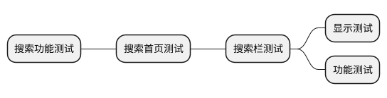

**问题**：
- 每个节点都有"测试"后缀，冗余
- 根节点已经表明这是测试案例，子节点无需重复

#### ✅ 正确示例

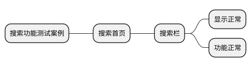

**改进**：
- 仅根节点保留"测试案例"说明用途
- 子节点直接使用功能名称
- 清晰简洁，易于理解

### 规范 2：简化验证点表达

**目的**：避免使用"验证XXX"的冗长表达。

#### ❌ 错误示例

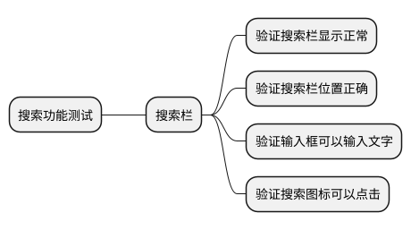

**问题**：
- "验证"一词重复出现，冗余
- 节点名称过长，降低可读性
- 层级关系不清晰

#### ✅ 正确示例

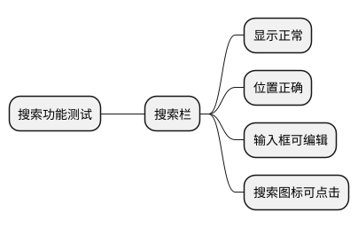

**改进**：
- 去掉"验证"前缀
- 直接描述预期结果
- 节点简洁，结构清晰

### 规范 3：功能模块 - 验证点结构

**目的**：使用父子节点关系，而非单一冗长节点。

#### ❌ 错误示例（单一节点包含所有信息）

**问题**：
- 单一节点过长，难以阅读
- 多个验证点混在一起
- 无法单独追踪每个验证点

#### ✅ 正确示例（父子节点结构）

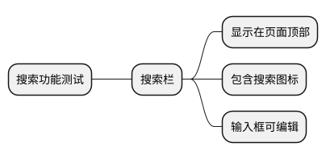

**改进**：
- 功能模块作为父节点
- 每个验证点作为独立子节点
- 结构清晰，易于维护

### 规范 4：动作与结果分离

**目的**：明确区分操作节点和验证节点。

#### ❌ 错误示例（操作和验证混在一起）

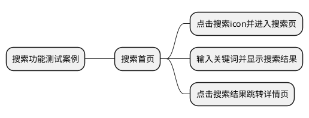

**问题**：
- 操作和验证混在一个节点
- 无法单独验证每个预期结果
- 测试步骤不清晰

#### ✅ 正确示例（操作和验证分离）

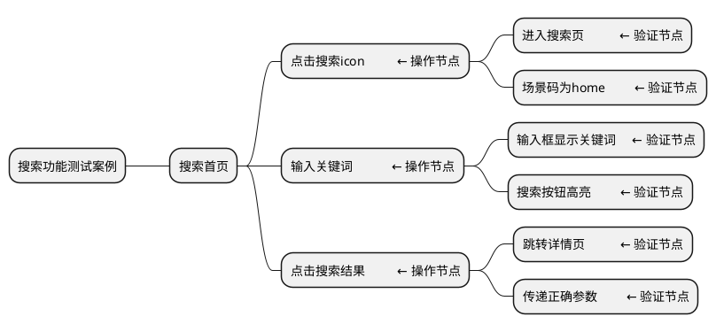

**改进**：
- 操作节点（三级）：描述具体操作
- 验证节点（四级）：描述预期结果
- 每个操作下可有多个验证点
- 测试步骤清晰可执行

### 规范 5：保持层级清晰

**目的**：每个验证点作为独立的子节点，避免过深或过浅。

#### ❌ 错误示例（层级过深）

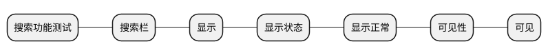

**问题**：
- 层级过深（7层），过度细分
- 信息冗余，可读性差

#### ❌ 错误示例（层级过浅）

**问题**：
- 层级过浅，所有验证点挤在一个节点
- 无法单独追踪每个验证点

#### ✅ 正确示例（层级适中）

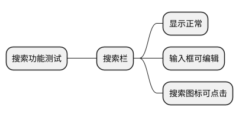

**改进**：
- 三层结构，清晰明了
- 每个验证点独立
- 易于理解和维护

## 📊 命名规范对比表

| 维度 | ❌ 错误示例 | ✅ 正确示例 |
|------|-----------|-----------|
| **去掉"测试"后缀** | `搜索栏测试` | `搜索栏` |
| **简化验证点** | `验证搜索栏显示正常` | `显示正常` |
| **功能模块-验证点** | `验证搜索栏显示正常且包含图标` | `搜索栏` → `显示正常` → `包含图标` |
| **动作与结果分离** | `点击搜索icon并进入搜索页` | `点击搜索icon` → `进入搜索页` |
| **层级清晰** | `搜索栏` → `显示` → `状态` → `正常` | `搜索栏` → `显示正常` |

## 📝 实战示例

### 示例 1：搜索功能

#### ❌ 不规范的命名

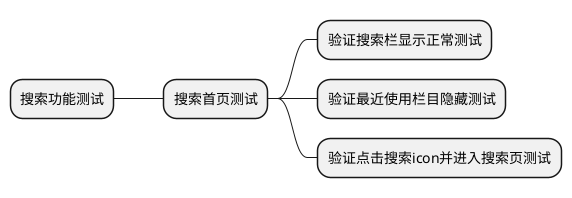

**问题识别**：
1. 过多"测试"后缀
2. 使用"验证XXX"格式
3. 操作和验证混在一起

#### ✅ 规范的命名

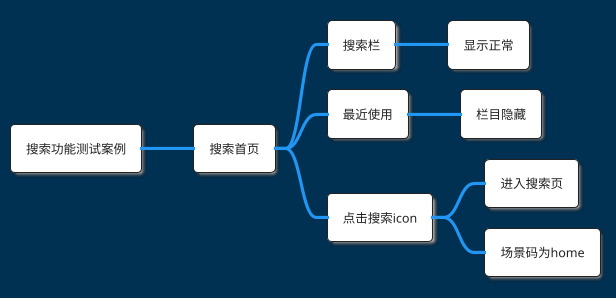

**改进点**：
1. 仅根节点保留"测试案例"
2. 去掉"验证"前缀
3. 操作和验证分离为父子节点
4. 结构清晰，层级合理

### 示例 2：用户登录

#### ❌ 不规范的命名

**问题识别**：
1. "测试"后缀冗余
2. 多个验证点混在一个节点
3. 操作和验证不分离
4. 节点名称过长

#### ✅ 规范的命名

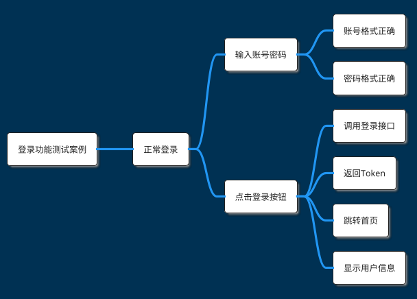

**改进点**：
1. 去掉"测试"后缀
2. 每个验证点独立节点
3. 操作节点（输入账号密码、点击登录按钮）
4. 验证节点（账号格式正确、跳转首页等）
5. 结构清晰，易于执行

### 示例 3：订单管理

#### ❌ 不规范的命名

**问题识别**：
1. 单一节点包含多个步骤
2. 无法区分操作和验证
3. 过长的节点名称

#### ✅ 规范的命名

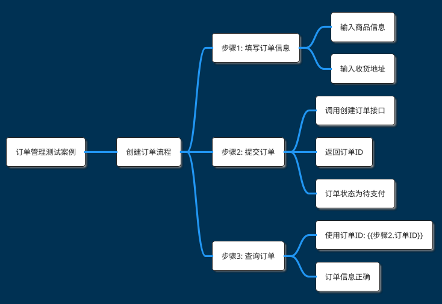

**改进点**：
1. 明确步骤顺序（步骤1、步骤2、步骤3）
2. 操作和验证分离
3. 数据传递标记清晰
4. 每个验证点独立

## 🎯 命名规范检查清单

生成测试案例后，检查以下项：

### 去掉"测试"后缀

- [ ] 仅根节点包含"测试案例"
- [ ] 一级节点（场景）不包含"测试"
- [ ] 二级节点（步骤）不包含"测试"
- [ ] 三级节点（验证）不包含"测试"

### 简化验证点表达

- [ ] 不使用"验证XXX"格式
- [ ] 直接描述预期结果
- [ ] 节点名称简洁（≤10个字）

### 功能模块 - 验证点结构

- [ ] 功能模块作为父节点
- [ ] 验证点作为子节点
- [ ] 避免单一节点包含多个验证点

### 动作与结果分离

- [ ] 操作节点明确描述操作
- [ ] 验证节点明确描述预期结果
- [ ] 操作节点下展开验证节点
- [ ] 每个操作有对应的验证点

### 保持层级清晰

- [ ] 层级深度适中（3-5层）
- [ ] 避免过度细分
- [ ] 每个验证点独立

## 📚 常见场景命名示例

### 页面展示类

❌ **错误**：`验证页面展示正常`
✅ **正确**：`页面展示` → `加载成功` → `元素显示正常`

### 数据查询类

❌ **错误**：`验证查询数据正确`
✅ **正确**：`查询数据` → `调用查询接口` → `返回数据正确`

### 表单提交类

❌ **错误**：`验证提交表单成功`
✅ **正确**：`提交表单` → `调用提交接口` → `返回成功` → `页面跳转`

### 权限校验类

❌ **错误**：`验证权限校验正确`
✅ **正确**：`权限校验` → `无权限提示` → `有权限可操作`

### 异常处理类

❌ **错误**：`验证异常处理正确`
✅ **正确**：`触发异常` → `捕获异常` → `提示错误信息` → `不影响其他功能`

## 💡 最佳实践建议

1. **始终从用户视角命名**：描述用户能看到的现象，而非技术实现
2. **使用主动语态**：`显示正常`而非`被显示正常`
3. **避免技术术语**：除非必要，使用通俗易懂的语言
4. **保持一致性**：同类验证点使用相同的命名模式
5. **定期Review**：团队定期Review测试案例，统一命名风格

---

**提示**：良好的命名规范能显著提高测试案例的可读性和可维护性，值得在团队中推广和遵守。
