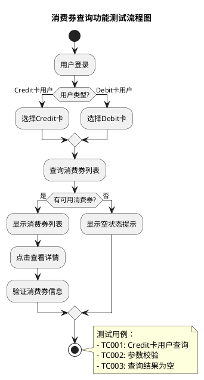

# 手工测试用例格式规范

**版本**: v1.0
**创建时间**: 2026-03-19
**适用阶段**: 第三阶段（手工案例生成）
**输出工具**: case-designer Skill
**下游消费者**: 测试执行、api-generator

---

## 📋 目录

- [概述](#概述)
- [YAML 结构定义](#yaml-结构定义)
- [字段说明](#字段说明)
- [测试用例编写规范](#测试用例编写规范)
- [输出格式](#输出格式)
- [使用场景](#使用场景)

---

## 概述

### 目标

将标准化需求文档（01）和验证报告（05）转换为结构化的手工测试用例，支持多种输出格式（PlantUML、XMind、Markdown）。

### 核心价值

1. **结构化测试用例**：统一的 YAML 格式，便于管理和维护
2. **多格式输出**：支持 PlantUML 流程图、XMind 思维导图、Markdown 文档
3. **可追溯性**：每个测试用例关联需求ID、接口ID
4. **优先级管理**：基于风险等级和测试重点自动分配优先级

### 输入输出

- **输入1**：`01-normalized-requirement.yaml`（测试场景、验收标准）
- **输入2**：`05-validation-report.yaml`（验证结果、风险提示）
- **输入3**：`03-normalized-cases.yaml`（历史案例参考，可选）
- **输出**：
  - YAML 格式测试用例（`06-manual-test-cases.yaml`）
  - PlantUML 流程图（`.puml` 文件）
  - XMind 思维导图（`.xmind` 文件）
  - Markdown 文档（`.md` 文件）

---

## YAML 结构定义

### 完整结构

```yaml
# ============================================
# 元数据（Metadata）
# ============================================
artifact_type: manual_test_cases        # 固定值
version: "1.0"                         # 格式版本
source_files:                          # 输入源文件
  - "01-normalized-requirement-v2.yaml"
  - "05-validation-report.yaml"
created_at: "2026-03-19T15:00:00+08:00"  # ISO 8601 格式
generator: "case-designer"      # 生成工具名称

metadata:
  project_name: "卡消费回赠券增加Credit消费场景"
  requirement_version: "V1.01"
  total_cases: 25                      # 测试用例总数
  generated_by: "case-designer v1.0"

# ============================================
# 测试套件（Test Suites）
# ============================================
test_suites:
  - suite_id: "TS001"
    suite_name: "消费券查询功能测试套件"
    description: "覆盖消费券列表查询、详情查询、筛选等功能的测试用例"
    related_requirements: ["F001", "F002"]
    priority: "high"

    # 测试用例列表
    test_cases:
      # ----------------------------------------
      # 正向场景
      # ----------------------------------------
      - case_id: "TC001"
        case_name: "Credit卡用户查询可用消费券列表"
        case_type: "positive"           # positive | negative | boundary
        priority: "P0"                  # P0 | P1 | P2
        risk_level: "high"              # high | medium | low

        # 关联信息
        related_requirement: "F001"
        related_interface: "IF001"
        related_validation_item: "AC001"

        # 前置条件
        preconditions:
          - "用户已登录ZA Bank App"
          - "用户拥有Credit卡"
          - "用户有可用的消费券"

        # 测试数据
        test_data:
          user_id: "user_credit_001"
          card_type: "CREDIT"
          voucher_status: "ACTIVE"

        # 测试步骤
        test_steps:
          - step: 1
            action: "打开ZA Bank App，进入消费券页面"
            expected_result: "消费券页面正常加载"

          - step: 2
            action: "选择卡类型筛选为Credit"
            expected_result: "筛选条件生效，仅显示Credit卡的消费券"

          - step: 3
            action: "查看消费券列表"
            expected_result: "列表显示所有可用的Credit卡消费券"

          - step: 4
            action: "点击查看消费券详情"
            expected_result: "消费券详情页显示完整信息（金额、有效期、使用条件）"

        # 预期结果
        expected_results:
          - "消费券列表仅显示Credit卡的消费券"
          - "消费券状态为'可用'"
          - "消费券金额正确"
          - "消费券有效期正确"

        # 验收标准
        acceptance_criteria:
          given: "Credit卡用户已登录，且有可用消费券"
          when: "用户查询消费券列表"
          then: "返回该用户的所有Credit卡消费券"

        # 标签
        tags: ["查询", "Credit卡", "正向场景", "核心功能", "P0"]

        # 预估执行时间
        estimated_duration: "5分钟"

        # 自动化建议
        automation_suggestion: "建议自动化，接口测试覆盖"

      # ----------------------------------------
      # 异常场景
      # ----------------------------------------
      - case_id: "TC002"
        case_name: "缺少必填参数查询消费券列表"
        case_type: "negative"
        priority: "P1"
        risk_level: "medium"

        related_requirement: "F001"
        related_interface: "IF001"
        related_validation_item: "AC001"

        preconditions:
          - "用户已登录"

        test_data:
          # 缺少 user_id
          card_type: "CREDIT"

        test_steps:
          - step: 1
            action: "调用查询消费券接口，不传userId参数"
            expected_result: "接口返回错误"

          - step: 2
            action: "查看错误信息"
            expected_result: "错误码为E001，错误信息为'用户ID不能为空'"

        expected_results:
          - "接口返回状态码400"
          - "错误码为E001"
          - "错误信息正确显示"

        acceptance_criteria:
          given: "用户已登录"
          when: "调用接口缺少必填参数userId"
          then: "接口返回错误码E001，提示'用户ID不能为空'"

        tags: ["查询", "异常场景", "参数校验", "P1"]

        estimated_duration: "3分钟"

        automation_suggestion: "建议自动化，接口异常场景覆盖"

      # ----------------------------------------
      # 边界场景
      # ----------------------------------------
      - case_id: "TC003"
        case_name: "查询结果为空（无可用消费券）"
        case_type: "boundary"
        priority: "P2"
        risk_level: "low"

        related_requirement: "F001"
        related_interface: "IF001"

        preconditions:
          - "用户已登录"
          - "用户没有可用的消费券"

        test_data:
          user_id: "user_without_vouchers"
          card_type: "CREDIT"

        test_steps:
          - step: 1
            action: "进入消费券页面"
            expected_result: "页面显示空状态提示"

          - step: 2
            action: "查看空状态文案"
            expected_result: "文案为'暂无可用消费券'"

        expected_results:
          - "消费券列表为空"
          - "显示友好的空状态提示"
          - "无错误提示"

        acceptance_criteria:
          given: "用户没有可用的消费券"
          when: "用户查询消费券列表"
          then: "返回空数组，并显示空状态提示"

        tags: ["查询", "边界场景", "空状态", "P2"]

        estimated_duration: "2分钟"

        automation_suggestion: "可选自动化，UI测试覆盖"

      # ----------------------------------------
      # 兼容性场景
      # ----------------------------------------
      - case_id: "TC004"
        case_name: "老版本App查看新数据格式消费券"
        case_type: "compatibility"
        priority: "P1"
        risk_level: "high"

        related_requirement: "F001"
        related_interface: "IF001"
        related_validation_item: "P1-003"

        preconditions:
          - "使用V3.7.0版本App"
          - "服务端已新增消费券类型字段"

        test_data:
          app_version: "V3.7.0"
          user_id: "user_compatibility_test"
          card_type: "CREDIT"

        test_steps:
          - step: 1
            action: "使用V3.7.0 App查询消费券列表"
            expected_result: "列表正常显示，新字段被忽略"

          - step: 2
            action: "查看消费券详情"
            expected_result: "详情页正常显示，不崩溃"

        expected_results:
          - "老版本App正常使用"
          - "新字段不影响老版本功能"
          - "无崩溃和异常"

        acceptance_criteria:
          given: "用户使用V3.7.0版本App"
          when: "查询包含新字段的消费券数据"
          then: "App正常显示，新字段被忽略，不崩溃"

        tags: ["查询", "兼容性", "老版本App", "P1"]

        estimated_duration: "5分钟"

        automation_suggestion: "建议手工测试，需要多版本App环境"

      # ----------------------------------------
      # 性能场景
      # ----------------------------------------
      - case_id: "TC005"
        case_name: "消费券列表查询响应时间验证"
        case_type: "performance"
        priority: "P1"
        risk_level: "medium"

        related_requirement: "F001"
        related_interface: "IF001"
        related_validation_item: "PERF001"

        preconditions:
          - "用户已登录"
          - "用户有大量消费券（> 100张）"

        test_data:
          user_id: "user_performance_test"
          card_type: "CREDIT"
          voucher_count: 150

        test_steps:
          - step: 1
            action: "发起消费券列表查询请求"
            expected_result: "请求在1秒内返回"

          - step: 2
            action: "记录响应时间"
            expected_result: "响应时间 < 1秒"

          - step: 3
            action: "查看列表数据"
            expected_result: "列表数据完整，无缺失"

        expected_results:
          - "响应时间 < 1秒"
          - "列表数据完整"
          - "无超时错误"

        acceptance_criteria:
          given: "用户有大量消费券"
          when: "查询消费券列表"
          then: "响应时间在1秒以内"

        tags: ["查询", "性能测试", "响应时间", "P1"]

        estimated_duration: "3分钟"

        automation_suggestion: "建议自动化，性能测试框架覆盖"

# ============================================
# 测试覆盖度分析（Coverage Analysis）
# ============================================
coverage_analysis:
  # 需求覆盖情况
  requirement_coverage:
    total_requirements: 4              # 需求总数
    covered_requirements: 4            # 已覆盖需求数
    uncovered_requirements: []         # 未覆盖需求
    coverage_rate: 100%                # 覆盖率

  # 接口覆盖情况
  interface_coverage:
    total_interfaces: 3                # 接口总数
    covered_interfaces: 3              # 已覆盖接口数
    uncovered_interfaces: []           # 未覆盖接口
    coverage_rate: 100%

  # 验收标准覆盖情况
  acceptance_criteria_coverage:
    total_ac: 5                        # 验收标准总数
    covered_ac: 5                      # 已覆盖验收标准数
    uncovered_ac: []                   # 未覆盖验收标准
    coverage_rate: 100%

  # 场景类型覆盖情况
  scenario_type_coverage:
    positive: 10                       # 正向场景数
    negative: 8                        # 异常场景数
    boundary: 4                        # 边界场景数
    compatibility: 2                   # 兼容性场景数
    performance: 1                     # 性能场景数

# ============================================
# 风险分析（Risk Analysis）
# ============================================
risk_analysis:
  # 高风险测试用例
  high_risk_cases:
    - case_id: "TC001"
      case_name: "Credit卡用户查询可用消费券列表"
      risk_factors:
        - "涉及资金操作"
        - "核心功能"
      test_priority: "P0"
      test_approach: "全量测试 + 自动化回归"

  # 需要重点关注的测试点
  focus_points:
    - point: "Credit卡消费券发放逻辑"
      reason: "新功能，涉及资金，风险高"
      related_cases: ["TC001", "TC006", "TC007"]

    - point: "兼容性测试"
      reason: "设计文档中提到App兼容性要求"
      related_cases: ["TC004", "TC015"]

# ============================================
# 执行建议（Execution Recommendations）
# ============================================
execution_recommendations:
  # 测试执行顺序建议
  execution_order:
    - phase: "冒烟测试"
      cases: ["TC001", "TC006", "TC010"]
      reason: "验证核心功能是否正常"

    - phase: "功能测试"
      cases: ["TC002", "TC003", "TC007", "TC008"]
      reason: "详细验证各功能点"

    - phase: "兼容性测试"
      cases: ["TC004", "TC015"]
      reason: "验证老版本App兼容性"

    - phase: "性能测试"
      cases: ["TC005"]
      reason: "验证性能指标"

  # 测试环境要求
  environment_requirements:
    - env: "sit"
      purpose: "功能测试、冒烟测试"
      data_requirements:
        - "Credit卡测试账号"
        - "Debit卡测试账号"
        - "无消费券测试账号"

    - env: "uat"
      purpose: "验收测试、兼容性测试"
      data_requirements:
        - "多版本App安装包（V3.7.0 - V3.7.4）"

  # 缺陷报告模板
  defect_report_template: |
    【缺陷标题】
    【所属模块】消费券查询功能
    【严重程度】高/中/低
    【优先级】P0/P1/P2
    【前置条件】
    【重现步骤】
    1.
    2.
    【预期结果】
    【实际结果】
    【附件】截图/日志

# ============================================
# 自动化建议（Automation Suggestions）
# ============================================
automation_suggestions:
  # 建议自动化的测试用例
  recommended_for_automation:
    - case_id: "TC001"
      reason: "核心功能，接口测试覆盖"
      automation_type: "API"

    - case_id: "TC002"
      reason: "异常场景，接口测试覆盖"
      automation_type: "API"

    - case_id: "TC005"
      reason: "性能测试，性能框架覆盖"
      automation_type: "Performance"

  # 建议手工测试的用例
  recommended_for_manual:
    - case_id: "TC004"
      reason: "需要多版本App环境，手工测试更高效"
      test_approach: "探索性测试"

  # 自动化优先级
  automation_priority:
    p0_cases: "优先自动化"             # P0级用例优先
    p1_cases: "次优先自动化"           # P1级用例次优先
    p2_cases: "可选自动化"             # P2级用例可选
```

---

## 字段说明

### 必选字段（MUST）

| 字段路径 | 类型 | 说明 |
|---------|------|------|
| `artifact_type` | string | 固定值 `manual_test_cases` |
| `version` | string | 格式版本，当前为 `"1.0"` |
| `source_files` | array | 输入源文件列表 |
| `created_at` | string | 创建时间，ISO 8601 格式 |
| `generator` | string | 生成工具名称 |
| `test_suites` | array | 测试套件列表 |

### 可选字段（OPTIONAL）

| 字段路径 | 类型 | 说明 |
|---------|------|------|
| `coverage_analysis` | object | 测试覆盖度分析 |
| `risk_analysis` | object | 风险分析 |
| `execution_recommendations` | object | 执行建议 |
| `automation_suggestions` | object | 自动化建议 |

---

## 测试用例编写规范

### 1. 测试用例命名

```yaml
# ✅ 正确：清晰描述测试场景
case_name: "Credit卡用户查询可用消费券列表"

# ❌ 错误：命名不清晰
case_name: "测试查询功能"
```

### 2. 测试步骤编写

```yaml
# ✅ 正确：步骤清晰，预期结果明确
test_steps:
  - step: 1
    action: "打开ZA Bank App，进入消费券页面"
    expected_result: "消费券页面正常加载"

# ❌ 错误：步骤不清晰
test_steps:
  - step: 1
    action: "测试查询"
    expected_result: "成功"
```

### 3. 前置条件编写

```yaml
# ✅ 正确：前置条件具体可验证
preconditions:
  - "用户已登录ZA Bank App"
  - "用户拥有Credit卡"
  - "用户有可用的消费券"

# ❌ 错误：前置条件模糊
preconditions:
  - "用户状态正常"
```

### 4. 预期结果编写

```yaml
# ✅ 正确：预期结果可验证
expected_results:
  - "消费券列表仅显示Credit卡的消费券"
  - "消费券状态为'可用'"
  - "消费券金额正确"

# ❌ 错误：预期结果模糊
expected_results:
  - "显示正确"
```

---

## 输出格式

### 1. PlantUML 流程图

**文件名**：`test_flow_消费券查询功能.puml`



### 2. XMind 思维导图

**文件名**：`test_cases_消费券功能.xmind`

**结构**：

```
消费券功能测试
├── 查询功能（TS001）
│   ├── 正向场景
│   │   ├── TC001: Credit卡用户查询可用消费券列表 (P0)
│   │   └── TC006: Debit卡用户查询消费券列表 (P1)
│   ├── 异常场景
│   │   ├── TC002: 缺少必填参数 (P1)
│   │   └── TC008: 无效的卡类型 (P2)
│   └── 边界场景
│       └── TC003: 查询结果为空 (P2)
├── 使用功能（TS002）
│   ├── 正向场景
│   │   └── TC010: 正常使用消费券 (P0)
│   └── 异常场景
│       └── TC011: 消费券已过期 (P1)
└── 兼容性测试（TS003）
    ├── TC004: 老版本App兼容性 (P1)
    └── TC015: 新数据格式兼容性 (P1)
```

### 3. Markdown 文档

**文件名**：`test_cases_消费券功能.md`

```markdown
# 消费券功能测试用例

**项目名称**：卡消费回赠券增加Credit消费场景
**生成时间**：2026-03-19 15:00
**用例总数**：25

---

## 📊 测试覆盖度

| 维度 | 总数 | 已覆盖 | 覆盖率 |
|------|------|--------|--------|
| 需求 | 4 | 4 | 100% |
| 接口 | 3 | 3 | 100% |
| 验收标准 | 5 | 5 | 100% |

---

## 🧪 测试套件

### TS001 - 消费券查询功能测试套件

**描述**：覆盖消费券列表查询、详情查询、筛选等功能的测试用例
**优先级**：高
**用例数量**：10

---

#### TC001 - Credit卡用户查询可用消费券列表

**类型**：正向场景
**优先级**：P0
**风险等级**：高

**前置条件**：
1. 用户已登录ZA Bank App
2. 用户拥有Credit卡
3. 用户有可用的消费券

**测试数据**：
- 用户ID: user_credit_001
- 卡类型: CREDIT

**测试步骤**：

| 步骤 | 操作 | 预期结果 |
|------|------|---------|
| 1 | 打开ZA Bank App，进入消费券页面 | 消费券页面正常加载 |
| 2 | 选择卡类型筛选为Credit | 筛选条件生效，仅显示Credit卡的消费券 |
| 3 | 查看消费券列表 | 列表显示所有可用的Credit卡消费券 |
| 4 | 点击查看消费券详情 | 消费券详情页显示完整信息 |

**预期结果**：
- ✅ 消费券列表仅显示Credit卡的消费券
- ✅ 消费券状态为'可用'
- ✅ 消费券金额正确
- ✅ 消费券有效期正确

**标签**：查询、Credit卡、正向场景、核心功能、P0

**预估执行时间**：5分钟

**自动化建议**：建议自动化，接口测试覆盖

---
```

---

## 使用场景

### 场景1：测试执行

**输入**：手工测试用例文档

**输出**：测试执行结果、缺陷报告

**使用字段**：
- `test_steps` - 执行测试步骤
- `expected_results` - 验证测试结果
- `preconditions` - 准备测试环境

### 场景2：自动化用例生成

**输入**：手工测试用例 + 标准化设计文档

**输出**：Python 自动化测试代码

**使用字段**：
- `automation_suggestion` - 判断是否需要自动化
- `related_interface` - 关联接口ID
- `test_data` - 测试数据

### 场景3：测试报告生成

**输入**：手工测试用例 + 执行结果

**输出**：测试报告（覆盖率、通过率、缺陷统计）

**使用字段**：
- `coverage_analysis` - 覆盖度分析
- `risk_analysis` - 风险分析
- `execution_recommendations` - 执行建议

---

## 最佳实践

### 1. 用例优先级分配

```yaml
# ✅ 正确：基于风险和重要性分配优先级
priority: "P0"
risk_level: "high"

# ❌ 错误：随意分配优先级
priority: "P0"
risk_level: "low"
```

### 2. 测试数据准备

```yaml
# ✅ 正确：测试数据具体可准备
test_data:
  user_id: "user_credit_001"
  card_type: "CREDIT"
  voucher_status: "ACTIVE"

# ❌ 错误：测试数据模糊
test_data:
  user: "测试用户"
  card: "测试卡"
```

### 3. 标签规范化

```yaml
# ✅ 正确：标准化标签
tags: ["查询", "Credit卡", "正向场景", "P0"]

# ❌ 错误：标签不规范
tags: ["test", "测试查询", "重要"]
```

---

## 版本历史

| 版本 | 日期 | 变更说明 |
|------|------|---------|
| v1.0 | 2026-03-19 | 初始版本，定义手工测试用例格式 |

---

## 附录

### 相关文档

- [00-overview.md](./00-overview.md) - Artifact Schemas 总览
- [01-normalized-requirement-v2.md](./01-normalized-requirement-v2.md) - 标准化需求文档格式
- [05-validation-report.md](./05-validation-report.md) - 需求验证报告格式
- [07-api-test-cases.md](./07-api-test-cases.md) - API 测试案例格式

### 参考实现

- [case-designer SKILL.md](../../skills/case-designer/SKILL.md)

---

**文档版本**: v1.0
**最后更新**: 2026-03-19
**维护者**: qe-toolkit 团队