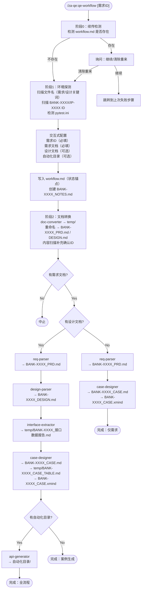

# Alfie QE - 银行测试自动化工具集 用户手册

[](https://gitlab.in.za/claude/alfie/qe)
[](https://gitlab.in.za/claude/alfie/qe)

## 📋 概述

QA Toolkit 是一个完整的测试左移解决方案，提供从需求分析到用例生成的全流程自动化能力。通过**八个核心 Skills** 和**六个工作流命令**的协同工作，帮助测试团队在开发早期介入，提升测试效率和质量。

> 项目架构、实施计划、团队信息见 [项目主文档](../../README.md)

---

## 🚀 快速开始

### 最快上手

```bash
/za-qe:qe-workflow
```

自动完成：环境探测 → 配置目录 → docx/doc 转 md → 需求分析 → 设计分析 → 测试左移分析 → 生成 API 自动化测试用例

### 首次使用推荐流程

```bash
# 1. 查看帮助信息
/za-qe:qe-help

# 2. 一键执行全流程（交互式引导）
/za-qe:qe-workflow

# 3. 查看生成结果
ls ./result/
```

---

## ⚡ 工作流命令

### `/za-qe:qe-workflow` - 全流程测试左移工作流 ⭐ 推荐

从原始文档到 API 自动化测试用例的**一站式全流程**：自动探测环境、交互式目录配置、文档格式转换、串联分析技能。

```bash
# 交互模式（推荐）：自动探测环境后引导配置
/za-qe:qe-workflow

# 指定需求ID（跳过ID询问）
/za-qe:qe-workflow BANK-12345
```

**执行流程**：



**优势**：

| 维度 | 手动逐步执行 | /za-qe:qe-workflow |
|------|------------|-----------|
| 步骤 | 5+ 步 | 1 步启动 |
| 断点续传 | 无 | 自动保存进度，可从失败步骤继续 |
| 文档转换 | 手动 markitdown | 自动批量转换 |
| 编码问题 | 容易遗漏 | 自动检测修复 |
| ID检测 | 手动确认 | 自动扫描文件名和内容 |
| Skill 串联 | 手动传路径 | 自动衔接 |
| 文件命名 | 自定义 | 统一 BANK-XXXX 规范 |

---

### `/za-qe:qe-gencase` - 场景测试案例生成

从需求文档生成可视化的场景案例设计（PlantUML流程图 + MindMap）。

```bash
# 从单个文档生成
/za-qe:qe-gencase ./docs/requirement.md

# 从多个文档生成（自动合并）
/za-qe:qe-gencase ./docs/req1.md ./docs/req2.docx ./docs/req3.txt

# 指定输出目录
/za-qe:qe-gencase ./docs/requirement.md --output ./review
```

**输出**：场景案例文档（Markdown格式，包含PlantUML代码）+ 场景案例表

---

### `/za-qe:full-workflow` - 完整模式（已合并）

> **已合并到 `/za-qe:qe-workflow`**。新版 workflow 已包含完整模式的所有功能（需求规范化 → 设计分析 → 测试用例生成），不再需要单独的 full-workflow 命令。

**迁移方式**：直接使用 `/za-qe:qe-workflow`

---

### `/za-qe:qe-status` - 查看工具状态

显示 za-qe 工具集的当前状态和可用功能。

```bash
/za-qe:qe-status
```

**输出示例**:
```
🔧 za-qe 工具集状态
━━━━━━━━━━━━━━━━━━━━━━━━━━━━━━━━━━━━

✅ 可用 Skills (8个):
  • /interface-extractor - 接口数据提取器
  • /doc-reviewer - 需求验证器
  • /za-qe:qe-gencase - 场景测试案例生成器
  • /api-generator - API用例生成器
  • /za-qe:req-parser - 需求文档规范化器
  • /design-parser - 设计文档规范化器 🚧

⚡ 工作模式:
  • 快速模式: 2步到位（接口测试）
  • 完整模式: 4阶段流程（全面质量保证）

📂 最近输出 (./result/):
  • test-analysis.md
  • api-test-cases/
```

---

### `/za-qe:qe-config` - 配置工具参数

管理 za-qe 工具集的配置项。

```bash
# 查看当前配置
/za-qe:qe-config

# 设置输出目录
/za-qe:qe-config output_dir ./test-output

# 切换工作模式
/za-qe:qe-config mode quick

# 设置测试环境
/za-qe:qe-config environments sit,auto_qe,uat

# 配置代码风格
/za-qe:qe-config code_style pep8

# 设置最大行长度
/za-qe:qe-config max_line_length 180

# 设置日志级别
/za-qe:qe-config log_level info
```

**可配置项**:

| 配置项 | 说明 | 默认值 | 示例值 |
|--------|------|--------|--------|
| `output_dir` | 输出目录 | `./result/` | `./test-output` |
| `mode` | 工作模式 | `quick` | `quick`/`full` |
| `code_style` | 代码风格 | `pep8` | `pep8`/`google`/`numpy` |
| `max_line_length` | 最大行长度 | `180` | `80`/`120`/`180` |
| `environments` | 测试环境列表 | `sit,auto_qe,uat` | 逗号分隔 |
| `log_level` | 日志级别 | `info` | `debug`/`info`/`warning`/`error` |

**配置存储**:
- 项目级: `.claude/za-qe.local.md`（YAML frontmatter）
- 全局级: `~/.claude/za-qe.config.yaml`
- 项目级配置优先级高于全局配置

---

### `/za-qe:qe-help` - 显示帮助信息

显示 za-qe 工具集的完整帮助信息。

```bash
# 显示完整帮助
/za-qe:qe-help

# 查看 Skills 详细说明
/za-qe:qe-help skills

# 查看工作流程
/za-qe:qe-help workflow

# 查看使用示例
/za-qe:qe-help examples
```

---

## 🔬 核心 Skills

### 1. interface-extractor（接口数据提取器）

从规范化设计文档中提取接口信息，生成接口数据报告。

- 提取接口路径、参数、响应结构
- 接口路径校验（dmb 网关检测）
- 微服务识别与映射
- 接口间依赖关系分析

```bash
/interface-extractor ./result/xxx_规范化开发方案.md
```

**输出**: 接口数据报告（Markdown 格式），保存到 `./result/`

---

### 2. doc-reviewer（需求验证器）

验证需求实现一致性，生成检查报告。

- 对比需求文档、设计文档、代码差异
- 验证需求实现完整性
- 生成文档质量评分（A/B/C/D）
- 提供针对性测试建议
- 识别测试风险点和解决措施

```bash
/doc-reviewer
```

**配置**：在技能内配置文档目录
- 需求文档目录: `./requirement_word`
- 设计文档目录: `./design_word`

**输出**: 需求实现检查报告（Word 格式）

---

### 3. case-designer（场景案例设计器）

从需求文档生成可视化的场景案例设计和结构化场景表。

- 解析需求文档（支持 Markdown）
- 生成业务流程图（PlantUML Activity Diagram）
- 生成测试功能点（PlantUML MindMap，三层）
- 生成详细测试案例（PlantUML MindMap，四层）
- 生成场景案例表（结构化 Markdown，供 api-generator 消费）

```bash
/za-qe:qe-gencase ./docs/requirement.md
```

**输出**: 场景案例文档 + 场景案例表（Markdown格式）

---

### 4. api-generator（API用例生成器）

基于测试方案生成 API 测试用例。

- 从测试左移方案提取接口测试点
- 自动生成 Python pytest 测试代码
- 生成多环境测试数据（YAML，支持 sit/auto_qe/uat）
- 生成执行脚本

```bash
/api-generator ./result/xxx_测试左移分析报告.md
```

**输出**: API 测试用例集（Python 代码 + YAML 数据），保存到 `./result/` 子目录

---

### 5. req-parser（需求文档规范化器）✅

将原始需求文档按 ZA Bank PRD 模板 7 章结构输出规范化 Markdown 文档。

- 解析原始需求文档（Word/Markdown/PDF）
- 提取业务痛点、功能需求、验收标准（给定-当-则格式）
- 输出 PRD 模板 7 章结构的规范化文档
- 大文档自动分段生成，避免超时

```bash
/za-qe:req-parser ./docs/requirement.docx
```

**输出**: 规范化需求文档（Markdown，7 章结构）

---

### 6. design-parser（设计文档规范化器）

检查开发方案文档是否符合规范，补全接口数据（通过 UDOC API），产出规范化 MD 文件。

- 按团队规范格式化和补全设计文档
- 通过 UDOC sync 接口自动补全接口参数
- 生成待补充清单（缺失章节标注）

```bash
/design-parser ./docs/design.docx
```

**输出**: 规范化开发方案（Markdown），保存到 `./result/`

---

### 7. doc-converter（文档转换器）

将 docx/doc 文档批量转换为 UTF-8 Markdown，自动修复编码问题。

- 批量转换 docx/doc → Markdown
- 自动检测和修复编码（utf-8/gb18030/big5 等）
- 作为 workflow 阶段 2 的执行者

```bash
/doc-converter ./docs/ ./output/
```

**输出**: UTF-8 编码的 Markdown 文件

---

### 8. code-diff-analysis（代码变更分析器）

通过 Jira API 获取需求的开发分支信息，分析代码变更，识别质量风险。

- 从 Jira 评论提取开发分支和服务信息
- 使用 git diff 分析代码变更（按模块分段）
- 识别 P0/P1/P2 质量风险
- 输出变更分析报告和测试策略

```bash
/code-diff-analysis BANK-89156
```

**输出**: 代码变更分析报告 + 测试策略文档（Markdown），保存到 `./result/`

---

## 📦 Skill 输入输出

各 Skill 之间通过标准化 Markdown 文档通信。每个 Skill 的参考文档位于 `skills/<name>/references/` 目录下。

### Skill 输入输出映射

| Skill | 输入格式 | 输出格式 |
|-------|---------|---------|
| req-parser | 原始需求文档 | 规范化需求文档（PRD 7 章结构） |
| design-parser | 原始设计文档 | 规范化设计文档 |
| doc-converter | docx/doc 文件目录 | UTF-8 Markdown 文件 |
| interface-extractor | 规范化设计文档 | 接口数据报告 |
| case-designer | 规范化需求 + 接口数据 | BANK-XXXX_CASE.md + temp/BANK-XXXX_CASE_TABLE.md + BANK-XXXX_CASE.xmind |
| api-generator | 场景案例表 + 接口数据 | API 测试代码 |
| doc-reviewer | 规范化需求 + 规范化设计 | 验证报告 |
| code-diff-analysis | Jira 需求编号 + 本地仓库 | 代码变更分析报告 + 测试策略 |
| api-generator | 场景案例表 + 接口数据 | API 测试代码 |

---

## 🎯 适用场景

### 适合

- 新功能开发，需要测试左移
- 需求变更，需要验证实现一致性
- API 接口开发，需要快速生成测试用例
- 测试团队早期介入开发过程
- 需要自动化生成测试文档

### 不适合

- 纯前端 UI 测试（建议使用其他工具）
- 性能测试（需要专门的性能测试工具）
- 安全渗透测试（需要安全测试工具）

---

## 🔧 高级配置

### Playwright MCP（可选）

interface-extractor 支持从网页提取内容，需要安装 Playwright MCP：

```bash
claude mcp add playwright npx @playwright/mcp@latest
```

### 文档目录配置

doc-reviewer 需要配置文档目录，可以在 SKILL.md 中修改默认配置：

```yaml
文档目录配置:
- 需求文档目录: `./requirement_word`
- 设计文档目录: `./design_word`
```

---

## 📚 详细文档

### 命令文档

| 命令 | 文档 | 说明 |
|------|------|------|
| `/za-qe:qe-workflow` ⭐ | [workflow.md](./commands/workflow.md) | 全流程测试左移工作流 |
| `/za-qe:qe-gencase` | [gencase.md](./commands/gencase.md) | 场景测试案例生成 |
| `/za-qe:full-workflow` | — | 已合并到 qe-workflow |
| `/za-qe:qe-status` | [status.md](./commands/status.md) | 查看工具状态 |
| `/za-qe:qe-config` | [config.md](./commands/config.md) | 配置工具参数 |
| `/za-qe:qe-help` | [help.md](./commands/help.md) | 显示帮助信息 |

### Skills 文档

| Skill | 文档 | 参考文档 |
|-------|------|---------|
| interface-extractor | [SKILL.md](./skills/interface-extractor/SKILL.md) | [references/](./skills/interface-extractor/references/) (2个), [examples/](./skills/interface-extractor/examples/) |
| doc-reviewer | [SKILL.md](./skills/doc-reviewer/SKILL.md) | [references/](./skills/doc-reviewer/references/) (1个) |
| case-designer | [SKILL.md](./skills/case-designer/SKILL.md) | [references/](./skills/case-designer/references/) (4个), [examples/](./skills/case-designer/examples/) (5个) |
| api-generator | [SKILL.md](./skills/api-generator/SKILL.md) | [references/](./skills/api-generator/references/) (6个), [examples/](./skills/api-generator/examples/) |
| req-parser | [SKILL.md](./skills/req-parser/SKILL.md) | [references/](./skills/req-parser/references/), [examples/](./skills/req-parser/examples/) |
| design-parser | [SKILL.md](./skills/design-parser/SKILL.md) | [references/](./skills/design-parser/references/) |
| doc-converter | [SKILL.md](./skills/doc-converter/SKILL.md) | [scripts/](./skills/doc-converter/scripts/) |
| code-diff-analysis | [SKILL.md](./skills/code-diff-analysis/SKILL.md) | [references/](./skills/code-diff-analysis/references/) (3个) |

---

**版本**: v2.5.8 | [项目主文档](../../README.md) | ZA Bank Test Team
