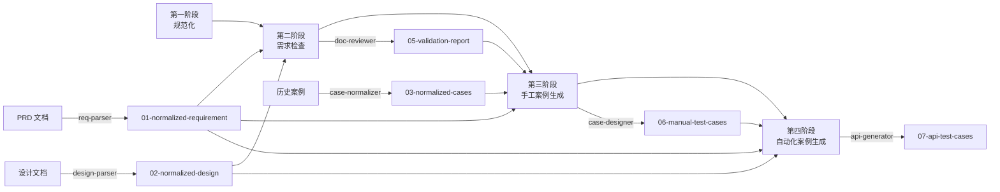

# Artifact Schemas 总览

**版本**: v1.0
**创建时间**: 2026-03-18
**适用范围**: za-qe 全流程测试左移工作流

---

## 📋 目录

- [概述](#概述)
- [设计原则](#设计原则)
- [四阶段工作流](#四阶段工作流)
- [七种 Artifact 格式](#七种-artifact-格式)
- [格式依赖关系](#格式依赖关系)
- [版本管理](#版本管理)

---

## 概述

### 什么是 Artifact Schemas？

**Artifact Schemas** 是 za-qe 插件中不同 Skills 之间通信的标准化格式规范。每个 Skill 的输出都是一个标准化的 Artifact（制品），作为下一个 Skill 的输入。

### 核心价值

1. **标准化通信**：不同 Skills 使用统一的 YAML 格式进行数据交换
2. **可追溯性**：每个 Artifact 都记录来源文件、处理工具、创建时间
3. **增量处理**：后续 Skill 可以只读取需要的字段，不需要完整解析
4. **版本兼容**：支持格式版本升级，保持向后兼容

### 适用场景

| 工作流模式 | Artifacts 流程 |
|-----------|---------------|
| **快速模式** | 输入文档 → 01-normalized-requirement → 07-api-test-cases |
| **完整模式** | 输入文档 → 01 → 02 → 05 → 06 → 07 |

---

## 设计原则

### 1. 以产品标准为主

**原则**：完全对齐 ZA Bank 的文档模板标准

- `01-normalized-requirement` 对齐 **ZA Bank PRD 模板**（7章）
- `02-normalized-design` 对齐 **ZA Bank 设计文档模板**（13章）
- 保留完整信息，不丢失任何业务细节

### 2. 结构化优先

**原则**：使用 YAML 格式定义关键信息，便于程序解析

```yaml
# 优点：清晰、可读、可解析
interfaces:
  - id: IF001
    path: "/api/v1/voucher/list"
    method: GET
```

### 3. 测试导向增强

**原则**：在产品标准基础上增加测试相关字段

| 增强字段 | 用途 |
|---------|------|
| `test_focus` | 标注测试重点功能 |
| `risk_level` | 标注风险等级（high/medium/low） |
| `confidence` | 标注信息置信度 |
| `related_interfaces` | 关联接口信息（从设计文档提取） |
| `scenarios` | 测试场景（从验收标准生成） |

### 4. 三级一致性检查

**原则**：每个 Artifact 输出前必须通过三级检查

| 检查级别 | 检查内容 | 处理方式 |
|---------|---------|---------|
| **P0（必须通过）** | 功能与验收标准对应、章节完整性 | 发现问题立即修复 |
| **P1（必须记录）** | 验收标准与场景对应、数据一致性 | 记录缺失项到 `missing_items` |
| **P2（建议项）** | 缺失项记录完整性、测试覆盖度 | 生成建议到 `recommendations` |

### 5. 置信度标记

**原则**：对提取的信息标注置信度

```yaml
pain_points:
  - description: "..."
    confidence: high      # 高置信度：直接从文档提取
    source: "PRD 第1章 1.1节"
```

**置信度判断标准**：

| confidence | 判断依据 |
|-----------|---------|
| `high` | 直接从文档明确描述中提取 |
| `medium` | 从文档推断得出，有一定依据 |
| `low` | 文档未明确说明，需要补充确认 |

---

## 四阶段工作流

### 完整模式流程（四阶段）



### 快速模式流程


---

## 七种 Artifact 格式

### 格式概览表

| 编号 | 名称 | 输入源 | 输出工具 | 下游消费者 | 状态 |
|------|------|--------|---------|-----------|------|
| 01 | [normalized-requirement](./01-normalized-requirement-v2.md) | PRD 文档 | req-parser | doc-reviewer<br/>case-designer<br/>api-generator | ✅ v2.0 |
| 02 | [normalized-design](./02-normalized-design.md) | 设计文档 | design-parser | doc-reviewer<br/>api-generator | ✅ v1.0 |
| 03 | normalized-cases | 历史案例 | case-normalizer | case-designer | 📋 计划中 |
| 04 | code-diff-report | Code Diff | code-diff-mcp | doc-reviewer | 📋 计划中 |
| 05 | validation-report | 01 + 02 + 04 | doc-reviewer | case-designer | 📋 计划中 |
| 06 | manual-test-cases | 01 + 03 + 05 | case-designer | 测试执行、api-generator | ✅ v1.0 |
| 07 | api-test-cases | 01 + 02 + 06 | api-generator | CI/CD 自动化执行 | ✅ v1.0 |

### 格式详细说明

#### 01 - normalized-requirement（标准化需求文档）

**定位**：PRD 文档的标准化 YAML 格式

**核心内容**：
- 需求背景与目标（第1章）
- 专业术语表（第2章）
- 业务逻辑与功能需求（第3章）
- 非功能需求（第4章）
- 验收标准（第5章）
- 版本规划（第6章）
- 附件（第7章）

**测试增强字段**：
- `features[].test_focus` - 测试重点标注
- `features[].risk_level` - 风险等级
- `scenarios` - 从验收标准生成的测试场景
- `business_rules` - 从各章节提取的业务规则

**详细规范**：[01-normalized-requirement-v2.md](./01-normalized-requirement-v2.md)

---

#### 02 - normalized-design（标准化设计文档）

**定位**：设计文档的标准化 YAML 格式

**核心内容**：
- 接口设计（微服务、路径、请求/响应、错误码）
- 数据库设计（DDL/DML）
- 兼容性分析（App、数据、发布）
- 业务降级方案
- 测试重点关注要点

**测试导向提取**：
- 仅提取测试相关内容
- 省略非测试内容（架构评审、发布机房、多线程安全）

**接口信息结构**：
```yaml
interfaces:
  - id: IF001
    name: "查询消费券列表"
    microservice: "za-mks-points-service"
    path: "/api/v1/voucher/list"
    method: GET
    request_params: [...]
    response_schema: [...]
    business_rules: [...]
    test_focus: true
    related_requirements: [F001]
```

**详细规范**：[02-normalized-design.md](./02-normalized-design.md)

---

#### 03 - normalized-cases（标准化历史案例）

**定位**：历史测试案例的标准化 YAML 格式

**核心内容**（计划中）：
- 案例基本信息
- 测试步骤
- 预期结果
- 执行结果
- 缺陷关联

**价值**：
- 为 `case-designer` 提供案例复用参考
- 建立测试案例知识库
- 支持相似功能案例推荐

**状态**：📋 计划中，预计 2026-04-15 定义格式

---

#### 04 - code-diff-report（代码差异报告）

**定位**：Code Diff 分析报告的标准化格式

**核心内容**（计划中）：
- 变更文件列表
- 变更类型（新增/修改/删除）
- 影响范围分析
- 风险评估

**输入源**：
- Git Diff 结果
- MCP 工具分析

**下游使用**：
- `doc-reviewer` - 检查需求实现一致性

**状态**：📋 计划中，预计 2026-04-10 定义格式

---

#### 05 - validation-report（需求验证报告）

**定位**：需求验证的输出报告

**核心内容**（计划中）：
- 一致性检查结果（P0/P1/P2）
- 缺失项列表
- 风险评估
- 改进建议

**输入源**：
- 01-normalized-requirement
- 02-normalized-design
- 04-code-diff-report（可选）

**下游使用**：
- `case-designer` - 生成针对性测试案例
- 项目管理 - 决策是否进入开发阶段

**状态**：📋 计划中，预计 2026-03-25 定义格式

---

#### 06 - manual-test-cases（手工测试案例）

**定位**：手工测试案例的标准化格式

**核心内容**：
- 案例ID、名称、优先级
- 前置条件
- 测试步骤
- 预期结果
- 关联需求（requirement_id）
- 关联接口（interface_id）

**输出格式**：
- PlantUML 流程图
- XMind 思维导图
- Markdown 文档

**已实现**：`case-designer` Skill

---

#### 07 - api-test-cases（API 自动化测试案例）

**定位**：API 自动化测试案例的标准化格式

**核心内容**：
- 测试代码（Python pytest）
- 测试数据（YAML）
- 测试配置（多环境）

**输出格式**：
```python
# tests/test_voucher_list.py
def test_voucher_list_success():
    """测试查询消费券列表成功"""
    # ...
```

```yaml
# data/voucher_list.yaml
sit:
  test_voucher_list_success:
    userId: "user001"
    cardType: "DEBIT"
```

**已实现**：`api-generator` Skill

---

## 格式依赖关系

### 依赖矩阵

| 下游 Artifact | 依赖的上游 Artifact |
|--------------|-------------------|
| 02-normalized-design | 无独立依赖（对应 PRD） |
| 05-validation-report | 01 ✅ + 02 ✅ + 04 📋 |
| 06-manual-test-cases | 01 ✅ + 03 📋 + 05 📋 |
| 07-api-test-cases | 01 ✅ + 02 ✅ + 06 ✅ |

### 数据流向图

```
PRD 文档 ────────────┐
                      │
                      ▼
          ┌───────────────────────┐
          │ 01-normalized-requirement │ ◄───── req-parser
          └───────────────────────┘
                      │
                      ├───────────────────────┐
                      │                       │
                      ▼                       ▼
          ┌───────────────────────┐   ┌───────────────────────┐
          │ 05-validation-report   │   │ 06-manual-test-cases   │
          └───────────────────────┘   └───────────────────────┘
                      │                       │
设计文档 ────────┐   │                       │
                  │   │                       │
                  ▼   │                       │
          ┌───────────────────────┐           │
          │ 02-normalized-design   │           │
          └───────────────────────┘           │
                      │                       │
                      ├───────────────────────┘
                      │
                      ▼
          ┌───────────────────────┐
          │ 07-api-test-cases      │
          └───────────────────────┘
```

---

## 版本管理

### 语义化版本

每个 Artifact 格式都遵循语义化版本（SemVer）：

- **Major（主版本）**：不兼容的格式变更（如删除必填字段）
- **Minor（次版本）**：向后兼容的功能新增（如新增可选字段）
- **Patch（修订）**：向后兼容的问题修复（如文档更新）

### 版本字段

每个 Artifact 必须包含版本字段：

```yaml
artifact_type: normalized_requirement
version: "2.0"              # 格式版本
metadata:
  doc_version: "V1.01"      # 源文档版本
```

### 兼容性处理

**读取时**：
- 检查 `artifact_type` 是否匹配
- 检查 `version` 是否支持
- 忽略未知字段（向前兼容）

**写入时**：
- 标注当前格式版本
- 记录源文档版本
- 记录处理工具名称

---

## 实施计划

### 已完成 ✅

- [x] 01-normalized-requirement-v2.md - 基于 ZA Bank PRD 模板
- [x] 02-normalized-design.md - 基于 ZA Bank 设计文档模板
- [x] 创建完整示例（output-normalized-requirement-v2.yaml）
- [x] 创建完整示例（output-normalized-design.yaml）

### 进行中 🚧

- [ ] 05-validation-report.md - 需求验证报告格式（优先级 P0）
- [ ] 07-api-test-cases.md - API 测试案例格式（优先级 P0）

### 计划中 📋

- [ ] 03-normalized-cases.md - 历史案例格式
- [ ] 04-code-diff-report.md - 代码差异报告格式
- [ ] 06-manual-test-cases.md - 手工案例格式（已有实现，需补充规范）

**预计完成时间**：
- 05、07 格式：2026-03-25
- 03、04、06 格式：2026-04-15

---

## 附录

### 相关文档

- [ZA Bank PRD 模板分析](../../skills/req-parser/references/01-prd-template-analysis.md)
- [ZA Bank 设计文档模板分析](../../skills/design-parser/references/01-design-template-analysis.md)

### 参考实现

- [req-parser SKILL.md](../../skills/req-parser/SKILL.md)
- [design-parser SKILL.md](../../skills/design-parser/SKILL.md)
- [case-designer SKILL.md](../../skills/case-designer/SKILL.md)
- [api-generator SKILL.md](../../skills/api-generator/SKILL.md)

---

**文档版本**: v1.0
**最后更新**: 2026-03-18
**维护者**: za-qe 团队