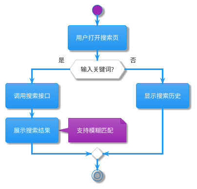
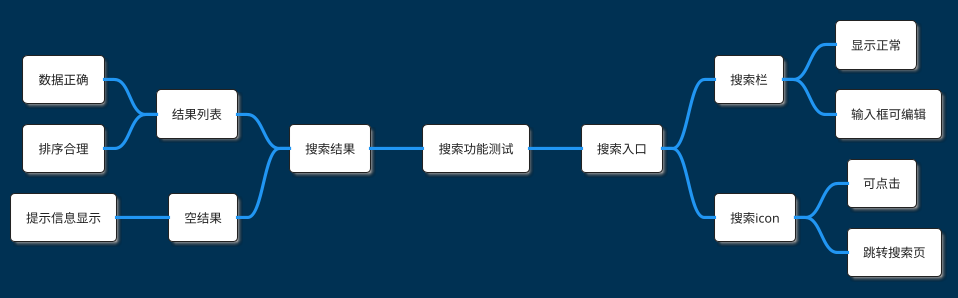
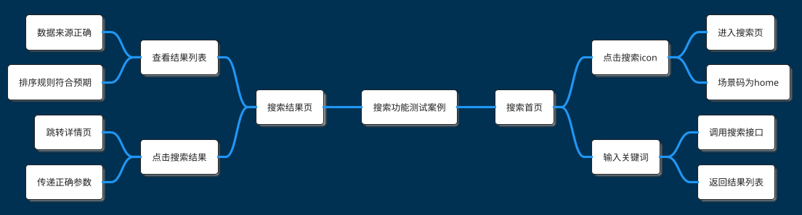

# 场景案例设计器

## 技能目标

基于需求文档（和可选的接口数据报告）生成可视化的测试设计和结构化的场景案例表，帮助测试团队快速设计全面的测试方案，同时为 `api-generator` 提供可消费的场景数据。

**产出物**：

1. **场景案例 Markdown**（内嵌 PlantUML 业务流程图 + 测试功能点 MindMap + 详细测试案例 MindMap，一份文件包含所有可视化内容）
   - workflow 中输出路径：`<根目录>/BANK-XXXX_CASE.md`
   - 独立调用时输出路径：`<输出目录>/<项目名>_CASE.md`
2. **XMind 文件**（从 Markdown 中自动提取详细测试案例 MindMap 并转换，给人编辑）
   - workflow 中输出路径：`<根目录>/BANK-XXXX_CASE.xmind`
   - 独立调用时输出路径：`<输出目录>/BANK-XXXX_CASE.xmind`
3. **场景案例表 Markdown**（结构化，给 api-generator 消费）
   - workflow 中输出路径：`<根目录>/temp/BANK-XXXX_CASE_TABLE.md`
   - 独立调用时输出路径：`<输出目录>/<项目名>_CASE_TABLE.md`

## 输入

### 必须输入

- **规范化需求文档**（req-parser 产出的 md 文件，**不读取原始 doc/docx**）

### 可选输入

- **接口数据报告**（interface-extractor 产出的 md 文件）
  - 有接口数据时，场景步骤会关联具体接口（IF-ID、路径、方法）
  - 无接口数据时，场景步骤的"调用接口"列留空或填写推断的接口描述

## 核心功能

### 1. 需求文档解析

> **调用方式说明**：workflow 串联调用时，输入必须是 req-parser 产出的 `.md` 文件（规范化需求文档）；独立调用时，以下格式均受支持：

**支持的文档格式（独立调用）**：

- Word 文档（.doc, .docx）
- Markdown 文件（.md）
- 纯文本文件（.txt）
- PDF 文档（.pdf）

**解析策略**：

- **自动识别文档结构**：章节标题、段落、列表、表格
- **提取业务信息**：功能描述、业务流程、验收标准、异常场景
- **容错处理**：即使文档不规范，仍尽力提取有用信息

**文档来源**：

- 单个或多个需求文档
- 支持任意目录位置（用户指定路径）
- 允许混合格式（同时处理 Word 和 Markdown）

> 💡 **提示**：文档质量越高，生成的测试用例越精准。建议文档包含清晰的功能描述和业务流程。

### 2. PlantUML 流程图生成

根据需求文档生成 PlantUML Activity Diagram，展示完整的业务流程。

**生成内容**：

- **主要流程**：核心业务步骤和操作
- **关键决策点**：条件分支和判断逻辑
- **异常处理**：错误场景和回滚流程
- **注释说明**：复杂步骤的解释（使用 `note` 语法）

**PlantUML 格式**：



**流程图特点**：

- 使用 `!theme materia` 主题（简洁美观）
- 整合所有需求文档的流程（多文档合并）
- 仅包含需求明确提及的内容（不添加推测）
- 复杂步骤添加注释（便于理解）

> 📖 **详细规则**：参见 `references/flowchart-generation.md` - PlantUML 流程图生成规则

### 3. 测试功能点 MindMap

基于需求文档生成测试功能点的 PlantUML MindMap，至少三层结构。

**生成内容**：

- **根节点**：项目或模块名称
- **一级节点**：主要功能模块（循环使用 `right side` / `left side`）
- **二级节点**：具体功能点
- **三级节点**：验证点或子功能

**PlantUML 格式**：



**命名规范**（重要）：

- ✅ **去掉"测试"后缀**：使用"搜索栏"而非"搜索栏测试"
- ✅ **简化验证点表达**：使用"显示正常"而非"验证搜索栏显示正常"
- ✅ **功能模块 - 验证点**结构：采用父子节点关系
  - 示例：`搜索栏` → `显示正常`
  - 避免：`验证搜索栏显示正常`

**节点组织**：

- 一级节点前添加 `right side` 或 `left side`（循环交替）
- 避免单独设置"边界值"、"安全"、"性能"一级节点（建议分散到具体功能下）
- 每个叶子节点应该可测试和可验证

> 📖 **详细规则**：参见 `references/test-points-mindmap.md` - 测试功能点 MindMap 生成规则

### 4. 详细测试案例 MindMap

基于测试功能点扩展为详细测试案例，至少四层结构。

**生成内容**：

- **根节点**：测试案例集名称
- **一级节点**：测试场景（循环使用 `right side` / `left side`）
- **二级节点**：测试步骤（操作节点）
- **三级节点**：验证点（预期结果节点）
- **四级节点**：详细验证内容（可选）

**PlantUML 格式**：



**命名规范**（关键）：

- ✅ **去掉"测试"后缀**：场景名称直接使用功能名称
- ✅ **动作与结果分离**：
  - 操作节点：`点击搜索icon`、`输入关键词`
  - 验证节点：`进入搜索页`、`场景码为home`
- ✅ **在操作节点下展开多个验证子节点**：
  ```
  ** 搜索首页
  *** 点击搜索icon        ← 操作节点
  **** 进入搜索页          ← 验证节点1
  **** 场景码为home         ← 验证节点2
  ```

**数据传递标记**（可选）：

- 如果测试步骤涉及数据传递，使用 `{{步骤N.字段名}}` 标记
- 示例：`用户ID: {{步骤1.返回的userId}}`
- 便于后续理解测试步骤间的依赖关系

> 📖 **详细规则**：参见 `references/test-cases-mindmap.md` - 详细测试案例 MindMap 生成规则

## 工作流程

### 步骤 1：文档接收与解析

```
接收需求文档（支持多种格式）→ 识别文档结构 → 提取业务信息 → 识别功能模块和业务流程
```

### 步骤 2：生成流程图（子代理执行）

流程图生成和验证在**子代理**中完成，避免验证重试循环污染主流程上下文。

#### 主流程：派发子代理

派发前准备（主流程执行）：
1. 用 `Glob` 工具定位 `validate_plantuml.py` 脚本绝对路径（`<插件根目录>/skills/case-designer/scripts/validate_plantuml.py`），不使用 `${CLAUDE_SKILL_DIR}`，确保子代理可用
2. 用 `Read` 工具读取 `<插件根目录>/skills/case-designer/references/flowchart-generation.md` 内容，嵌入子代理 prompt

用 `Task` 工具派发一个子代理，Task prompt 须包含：
- 需求文档绝对路径：`<根目录>/BANK-XXXX_PRD.md`（子代理自行 Read）
- 验证脚本绝对路径（上一步已计算）
- 临时文件路径：`<根目录>/temp/flowchart_validate.puml`
- 输出文件路径：`<根目录>/temp/flowchart_result.puml`
- `flowchart-generation.md` 的完整内容（让子代理知晓生成规范）

#### 子代理任务

1. 读取需求文档，分析业务流程，识别主要步骤和决策点
2. 按照 prompt 中传入的 flowchart-generation.md 规范生成 PlantUML Activity Diagram
3. 用 `Write` 工具将流程图代码块写入 `<根目录>/temp/flowchart_validate.puml`
4. 执行验证：
   ```bash
   uv run '<验证脚本绝对路径>' --file '<根目录>/temp/flowchart_validate.puml'
   ```
5. 若返回 `ERROR` → 根据错误信息修正代码块，用 `Edit` 更新临时文件，重新验证（最多重试 5 次）
6. 验证通过后将最终代码块写入结果文件 `<根目录>/temp/flowchart_result.puml`
7. 在输出中包含状态标记：
   - 成功：`---STATUS---\nOK\n---END---`
   - 5次仍失败：`---STATUS---\nWARN 流程图验证失败，已保留最后一次生成结果，请人工检查\n---END---`

#### 主流程：接收子代理结果

主流程用正则从子代理输出中提取 `---STATUS---\n(.*?)\n---END---` 判断状态：

1. 先用 `Read` 工具读取 `<根目录>/temp/flowchart_result.puml` 内容（赋值给变量）
2. 若读取失败（文件不存在）→ 标注"⚠️ 流程图生成失败，结果文件不存在"，跳过流程图，继续步骤3
3. 读取成功后删除两个临时文件（`flowchart_validate.puml`、`flowchart_result.puml`）
4. 状态为 `OK` → 将读取内容作为流程图代码块，继续步骤3
5. 状态为 `WARN` → 同样继续，但在最终输出中标注"⚠️ 流程图语法存在问题，建议人工检查"

### 步骤 3：生成测试功能点

```
提取功能模块 → 分解为功能点 → 生成三层MindMap → 应用命名规范
```

### 步骤 4：生成详细测试案例

```
基于测试功能点 → 扩展为测试步骤 → 生成四层 MindMap → 区分操作和验证
```

### 步骤 5：输出 Markdown 文件

```
整合三个PlantUML 代码块 → 添加测试策略说明 → 输出 Markdown 到指定目录
```

> **注意**：PlantUML 代码全部内嵌在 Markdown 文件的代码块中，不单独输出 `.puml` 文件。


### 步骤 6：生成场景案例表

基于步骤 3、4 的测试功能点和详细测试案例，生成结构化的**场景案例表 Markdown**，符合 `references/scenario-table.md` 规范。

**生成内容**：

- **场景总览表**：场景ID、名称、类型（positive/negative/flow/boundary）、优先级、涉及接口、来源
- **场景详情**：每个场景的前置条件、步骤表（操作/调用接口/请求要点/预期结果）、验证点

**场景来源优先级**：

1. **从验收标准生成**（最优先）：每个 AC 至少对应一个场景
2. **从用户故事生成**：构建端到端业务流程场景
3. **从业务规则生成**：生成边界和异常场景
4. **从接口依赖推断**：补充接口串联的 flow 场景（需有接口数据报告）

**数据传递标记**：使用 `{{步骤N.字段名}}` 标记步骤间的数据依赖

**输出文件**：`<输出目录>/temp/<项目名>_CASE_TABLE.md`

> 场景案例表始终输出到 `<输出目录>/temp/` 子目录（而非输出目录根），workflow 调用和独立调用均遵循此规则。

> 详细格式参见 `references/scenario-table.md`
> 场景识别指南参见 `references/scenario-identification.md`
> 用例设计模式参见 `references/test-case-patterns.md`

### 步骤 7：自动生成 XMind 文件

```
从 Markdown 文件中提取详细测试案例 MindMap 代码块 → 调用 ${CLAUDE_SKILL_DIR}/scripts/plantuml_to_xmind.py 脚本 → 转换为 XMind 格式 → 输出到同目录
```

**自动转换逻辑**：

- 从 Markdown 输出文件中提取需求ID（如 `BANK-1234`）
- 从 Markdown 中提取详细测试案例的 PlantUML MindMap 代码块
- 使用脚本自动转换为 `BANK-XXXX_CASE.xmind`

> 💡 **提示**：XMind 文件会自动生成在输出目录中，便于团队协作编辑和可视化展示。

## 输出格式

生成的文件包括：

- **场景案例 Markdown**（`BANK-XXXX_CASE.md`）：包含 PlantUML 代码块的完整测试设计文档（流程图、功能点、测试案例全部内嵌），放根目录
- **XMind 文件**（`BANK-XXXX_CASE.xmind`）：自动从 Markdown 中提取 MindMap 并转换，放根目录
- **场景案例表**（`temp/BANK-XXXX_CASE_TABLE.md`）：结构化 Markdown 表格，供 api-generator 消费，放 temp/ 目录

### Markdown 文件结构

生成的 Markdown 文件包含以下部分：

### 1. 文档信息

```markdown
# XX项目 场景案例

## 文档信息

- **生成时间**: 2026-03-17 14:30:00
- **需求文档来源**:
  - ./docs/requirement1.md
  - ./docs/requirement2.docx
- **生成模式**: 弱标准模式（快速生成）
```

### 2. 业务流程图

````markdown
## 业务流程图

```plantuml
@startuml
!theme materia

start
:用户打开搜索页;
...
stop

@enduml
```
````

### 3. 测试功能点

````markdown
## 测试功能点

```plantuml
@startmindmap
!theme blueprint
!theme materia

* 搜索功能测试

right side
** 搜索入口
*** 搜索栏
...

@endmindmap
```
````

### 4. 详细测试案例

````markdown
## 详细测试案例

```plantuml
@startmindmap
!theme blueprint
!theme materia

* 搜索功能测试案例

right side
** 搜索首页
*** 点击搜索icon
...

@endmindmap
```
````

### 5. 测试策略建议

```markdown
## 测试策略建议

### 测试重点

- 核心业务流程：搜索功能、结果展示
- 异常场景：空结果、网络异常

### 测试优先级

- P0（高优先级）：核心搜索流程
- P1（中优先级）：结果排序、筛选
- P2（低优先级）：搜索历史、推荐

### 测试方法

- 功能测试：覆盖所有功能点
- 边界值测试：空输入、超长输入
- 兼容性测试：不同设备和浏览器
```

> 📖 **完整示例**：参见 `examples/sample-output.md` - 完整输出示例

## 使用指南

### 基本用法

```bash
# 从单个文档生成
/case-designer ./docs/requirement.md

# 从多个文档生成（自动合并）
/case-designer ./docs/req1.md ./docs/req2.docx ./docs/req3.txt

# 指定输出目录
/case-designer ./docs/requirement.md --output ./custom-output
```

### 参数说明

| 参数              | 说明                               | 示例                |
| ----------------- | ---------------------------------- | ------------------- |
| `<文档路径>`      | 需求文档路径（必填，支持多个）     | `./docs/req.md`     |
| `--output <目录>` | 输出目录（可选，默认 `./result/`） | `--output ./output` |
| `--format <格式>` | 输出格式（可选，默认 `markdown`）  | `--format markdown` |
| `--no-strategy`   | 不生成测试策略建议（可选）         | `--no-strategy`     |

### 使用场景

#### 场景 1：快速生成测试设计

```bash
# 产品提供需求文档后立即生成测试设计
/case-designer ./docs/new-feature.md
```

**预期输出**：

- `./result/BANK-XXXX_CASE.md` - 场景案例 Markdown（含 PlantUML 代码块）
- `./result/BANK-XXXX_CASE.xmind` - XMind 文件（自动生成）
- `./result/temp/BANK-XXXX_CASE_TABLE.md` - 场景案例表（供 api-generator 消费）

#### 场景 2：多文档整合

```bash
# 多个需求文档整合为一个测试方案
/case-designer ./docs/req1.md ./docs/req2.md ./docs/req3.docx
```

**预期输出**：

- `./result/BANK-XXXX_CASE.md` - 场景案例 Markdown（含 PlantUML 代码块）
- `./result/BANK-XXXX_CASE.xmind` - XMind 文件（自动生成）
- `./result/temp/BANK-XXXX_CASE_TABLE.md` - 场景案例表（供 api-generator 消费）

#### 场景 3：测试评审

```bash
# 生成可视化测试用例用于评审
/case-designer ./docs/requirement.docx --output ./review
```

**预期输出**：

- `./review/BANK-XXXX_CASE.md` - 场景案例 Markdown（含 PlantUML 代码块）
- `./review/BANK-XXXX_CASE.xmind` - XMind 文件（可用 XMind 软件打开编辑）
- `./review/temp/BANK-XXXX_CASE_TABLE.md` - 场景案例表（供 api-generator 消费）

## 注意事项

### 文档质量建议

文档质量直接影响生成效果。包含以下内容可获得更佳结果：

- ✅ 清晰的功能描述
- ✅ 明确的业务流程
- ✅ 具体的验收标准
- ✅ 异常场景说明

文档过于简单或不规范时，生成的测试用例可能不够全面。

### PlantUML 和 XMind 使用

**PlantUML 渲染**：

- **在线渲染**：[PlantUML Online](http://www.plantuml.com/plantuml/uml/)
- **VS Code 插件**：PlantUML
- **本地渲染**：安装 PlantUML CLI

**XMind 使用**：

- 自动生成的 `.xmind` 文件可以用 [XMind](https://www.xmind.net/) 软件打开
- 支持在线协作编辑和导出为多种格式（PDF、图片等）
- 更适合团队评审和迭代修改

### 后续优化

本技能生成的测试案例适合人工 Review 和调整：

- 📝 人工补充遗漏的测试点
- 📝 调整测试优先级
- 📝 细化测试步骤

如需生成自动化测试代码，可将此输出作为参考，结合 `api-generator` 技能。

## 最佳实践建议

### 1. 文档准备

- **单一职责**：每个文档聚焦一个功能模块
- **清晰结构**：使用标题、列表、表格组织内容
- **完整信息**：包含功能、流程、验收标准

### 2. 测试设计

- **优先核心流程**：先设计主要业务流程的测试
- **覆盖异常场景**：不要忽略错误处理和边界条件
- **合理分层**：功能点分解到合适的粒度（不宜过粗或过细）

### 3. 团队协作

- **评审机制**：生成后组织团队评审，补充遗漏点
- **版本管理**：将生成的测试案例纳入版本控制
- **持续更新**：需求变更后及时更新测试设计

## 额外资源

### 脚本工具

格式转换实用脚本：

- **`${CLAUDE_SKILL_DIR}/scripts/plantuml_to_xmind.py`** - PlantUML MindMap 转 XMind 格式工具
  - 用法：`uv run ${CLAUDE_SKILL_DIR}/scripts/plantuml_to_xmind.py <Markdown文件或PlantUML文件> <需求ID>`
  - 示例：`uv run ${CLAUDE_SKILL_DIR}/scripts/plantuml_to_xmind.py ./result/BANK-XXXX_CASE.md BANK-XXXX`
  - 输出：生成到输入文件同目录，文件名为 `BANK-XXXX_CASE.xmind`
  - **注意**：在子代理（Task）中 `${CLAUDE_SKILL_DIR}` 不可用，须由主流程预先计算脚本绝对路径后传入

### 参考文件

详细的技术参考和规则：

- **`references/flowchart-generation.md`** - PlantUML 流程图生成规则
- **`references/test-points-mindmap.md`** - 测试功能点 MindMap 生成规则
- **`references/test-cases-mindmap.md`** - 详细测试案例 MindMap 生成规则
- **`references/naming-conventions.md`** - 测试案例命名规范详解
- **`references/scenario-identification.md`** - 场景测试用例识别指南
- **`references/test-case-patterns.md`** - 测试用例设计模式
- **`references/requirement-integration.md`** - 需求文档结合分析指南

### 示例文件

实用的完整示例：

- **`examples/sample-requirement.md`** - 示例需求文档
- **`examples/sample-output.md`** - 完整输出示例
- **`examples/sample-flowchart.puml`** - 流程图示例
- **`examples/sample-test-points.puml`** - 测试功能点示例
- **`examples/sample-test-cases.puml`** - 测试案例示例
- **`examples/scenario-test-cases.md`** - 场景测试用例设计示例
- **`examples/sample-with-requirement.md`** - 结合需求文档的场景示例

### 相关 Artifact Schemas

- **`references/scenario-table.md`** - 场景案例表格式规范
- **`references/interface-data-report.md`** - 输入：接口数据报告格式
- **`references/normalized-requirement.md`** - 输入：标准化需求文档格式

---

**状态**: ✅ 可用 | **版本**: v2.0.0
